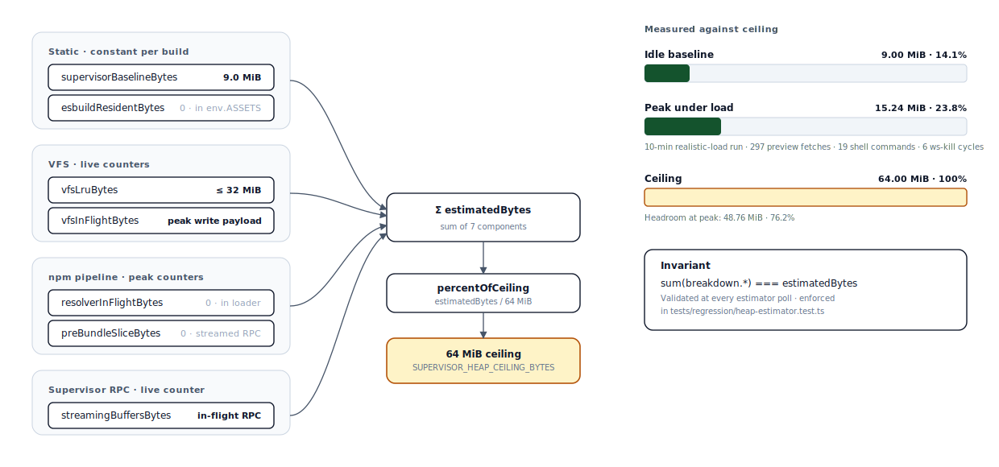

# Nimbus

A browser-native cloud development environment, built on Cloudflare Durable Objects.

🌐 **Live:** https://nimbus.ashishkmr472.workers.dev


## What it does

Open a URL. You get a real shell, 60+ Unix commands, and a 10 GB filesystem that
survives every reconnect. `npm install` reaches the live registry. `node` runs
scripts and servers. `git clone` works over HTTPS. A Vite-compatible dev server
ships HMR to a preview iframe alongside the terminal.

The whole workspace lives inside one Cloudflare Durable Object — your supervisor —
which fans out compute to ephemeral Worker Loader isolates and to a stateful DO
Facet running Vite. Storage is SQLite-backed and durable. The supervisor is the
single source of truth for the filesystem, npm cache, port registry, and process
table; everything else is replaceable.

The session URL is the identity of your DO instance. Bookmark it and your
filesystem is still there tomorrow. Share it and a teammate joins the same
process tree.

## Architecture

### System topology


Solid lines move data and control. Dashed amber lines carry RPC results back to
the supervisor. Worker Loader isolates do CPU-bound work — resolver BFS, tarball
gunzip, esbuild, child process dispatch — and stream their results home through
WorkerEntrypoint RPC. R2 fronts cross-tenant assets; `caches.default` (not
shown; per-colo L2) sits in front of R2 and `env.ASSETS` for hot reads.

### Session lifecycle — R · B · W · O


Cold start runs all four phases. Warm rejoin after a `webSocketError` runs only
two — the shell, kernel, and 60 commands are still resident, so Build and Online
are skipped. Every transition writes a row into a 50-entry `recovery_event` ring,
which itself survives DO eviction. The architectural promise is one line:
`dataLoss === false` at every transition.

### Memory budget — 64 MiB ceiling



Seven counters sum to `estimatedBytes`. A test asserts the sum equals the total
at every poll — no silent leaks, no accounting drift. The headroom number on the
right is the architectural commitment of the Phase 5 rebuild and is reproduced
once, in [Performance](#performance), from a 10-minute realistic-load run.

### Layered architecture


Layers 3 and 4 each get their own 128 MiB V8 isolate, separate from the
supervisor's 128 MiB. The 64 MiB application ceiling at layer 2 is the only
budget the supervisor itself has to keep. The 4-loaders-per-method-context cap
is structurally avoided on every hot path, either by chain-serialising through
one slot (cp-spawn) or by routing through the peer-DO sibling pool when fan-out
width crosses five (npm-install, large resolver cohorts).

## Primitive scorecard

Every subsystem maps to one of four Cloudflare primitives. Current state matches
target everywhere except cirrus-real Vite, which is platform-gated.

| Subsystem | Target | Current | Why this primitive |
|---|---|---|---|
| `npm-resolve` (BFS) | Worker Loader | matches | Ephemeral fan-out; per-spec hash → stable LOADER ID; isolate dies when the work does |
| `npm-install` batch | Worker Loader | matches | Stateless extract + write; nothing to preserve between batches |
| `pre-bundle` (esbuild) | Worker Loader | matches | One isolate per dep; result streamed via ReadableStream-over-RPC |
| `tarball` decompression | Worker Loader | matches | Streaming tar parse; pure compute |
| `git` clone/fetch | Worker Loader | matches | isomorphic-git pre-bundled; no per-clone state |
| `cp-spawn` (child_process) | Worker Loader | matches | Fresh isolate per spawn; chain-serialised through one slot to dodge the 4-loader cap |
| **`cirrus-real` Vite** | **DO Facet** | **fetcher-fallback¹** | Best fit for stateful in-memory thread pool sharing one host; target adds per-instance own-SQLite + hibernation. /preview/ behaviour is identical |
| Session state (cwd · env · mounts · scrollback) | DO SQLite | matches | Source of truth for everything that must outlive `webSocketError` |
| Recovery event ring + OOM forensics | DO SQLite | matches | 50-entry bounded ring; survives DO eviction |
| npm tarball + packument cache | R2 | matches | Cross-tenant L3 cache; capacity past one DO's 10 GB |
| Per-colo L2 (packument · tarball · esbuild-wasm) | `caches.default` | matches | Hot-read cache fronting R2 + `env.ASSETS` |
| Supervisor IPC | WorkerEntrypoint RPC | matches | Promise pipelining; ReadableStream-over-RPC bypasses the 32 MiB structured-clone limit |
| Two-tier fan-out | Worker Loader + DO peer pool | matches | Routes by width: in-DO POC C (`< 5`) for small N, peer-DO POC B (`≥ 5`) for large N |

¹ cirrus-real Vite runs as `kind = 'fetcher-fallback'` — a stateless `WorkerEntrypoint` default export that shares module-scope vite-bootstrap state — instead of the `ctx.facets.get(name, {class})` DO-Facet target. The DO-Facet path needs `worker.getDurableObjectClass()`, which only ships under the `$experimental` compatibility flag, and Cloudflare's deploy validator rejects `$experimental` for non-CF-team accounts (error 10021). Tracked as [RM-27238](https://jira.cfdata.org/browse/RM-27238). When the flag promotes to GA, the runtime feature-probe at `src/facets/cirrus-real.ts:start()` switches paths without a Nimbus code change.

## Performance

All numbers measured against the live deploy. Sources: `audit/sections/*-retro.md`.

| Surface | Idle | Peak under load | Headroom |
|---|---:|---:|---:|
| Supervisor heap (64 MiB ceiling) | 9.00 MiB | **15.24 MiB · 23.8%** | **48.76 MiB · 76.2%** |
| `recovery_event` ring | 0 | 6 ws-kill events / 10 min | bounded 50 |
| `dataLoss` events | 0 | 0 / 10 min · 6 cycles | invariant |

| Cache layer | Speedup vs cold (median) | Notes |
|---|---:|---|
| L2 packument (`caches.default`) | **11.0×** | 5-min TTL mirroring R2 customMetadata |
| L2 tarball | **9.2×** | Eternal · content-addressed |
| L2 esbuild-wasm | **16.0×** | Eternal · content-addressed; ~12 MiB transfer dropped per facet boot |

| Fan-out site | Speedup vs serial baseline | Topology |
|---|---:|---|
| `npm install` batch (N = 8) | **5.54×** (best of 5.09–5.94) | POC B peer-DO with stable-id router |
| Resolver fan-out (vite · webpack · drizzle-orm · express · zod) | **2.26× avg** (peak 3.16× drizzle-orm) | Frontier coordinator; in-DO POC C |

| Operation | Wall time | Conditions |
|---|---:|---|
| `git clone` 1 600-file repo | 12–17 s | HTTPS via cf-git fork; W7 writeBatchStream pipeline |
| `npm install zod` (cold session) | ~6 s | Resolver, fetch, tar decode, VFS write |
| `node -e 'console.log(…)'` (warm) | 102–152 ms | Fresh Worker Loader isolate per call |
| Vite hot reload (W10 · `wrangler dev`) | 302 ms median | Target: under 500 ms |

The peak heap figure includes Vite running, 297 preview fetches, 19 shell
commands, and 6 forced `webSocketError` cycles inside a single 10-minute window.
Drift across the run is 275 bytes.

## Quickstart

```bash
git clone https://github.com/AshishKumar4/Nimbus.git
cd Nimbus
bun install
bun run dev      # wrangler dev --ip 0.0.0.0 --port 8787
```

Open http://localhost:8787, click **Launch**, and you are inside your own DO.
The Launch button mints a session ID and 302s to `/s/<id>/`. That URL is the
identity of your Durable Object — bookmark it, share it, or come back to it
in a week.

## License + author

MIT. Built by [Ashish Kumar Singh](https://github.com/AshishKumar4) on top of
[LIFO OS](https://github.com/lifo-sh/lifo) by [Sanket Sahu](https://github.com/sanketsahu),
which seeded the shell interpreter, coreutils, and Node.js shim (MIT). The
Cloudflare-native primitives — Durable Objects with SQLite storage, Worker
Loaders, DO Facets, R2, `caches.default`, and WorkerEntrypoint RPC — are the
architectural backbone.
