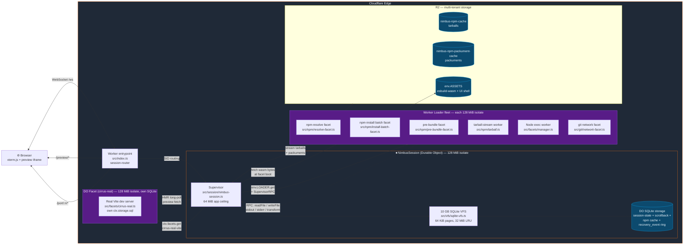
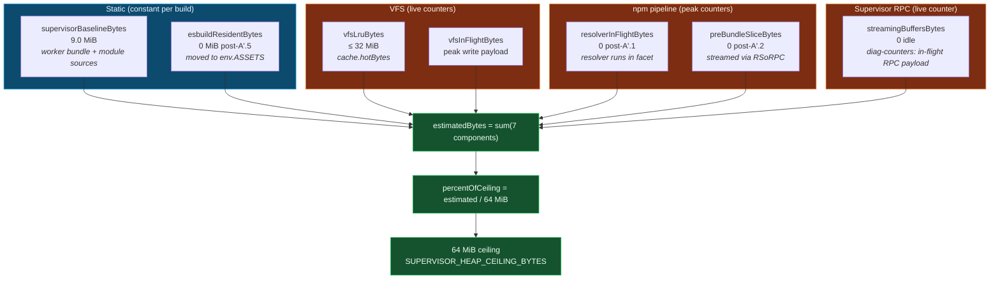
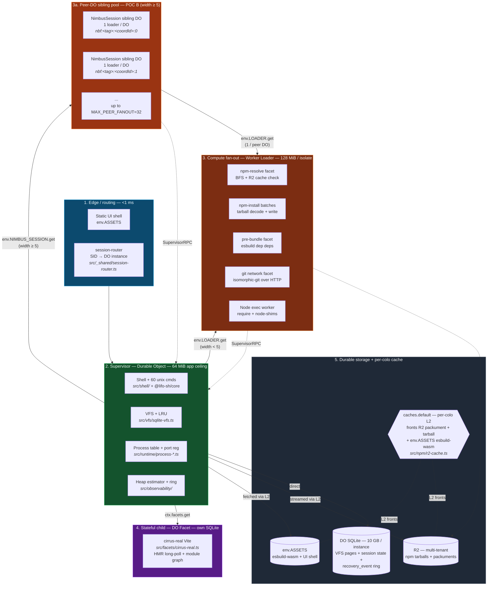

<p align="center">
  <br />
  
  
  
  
</p>

<h1 align="center">Nimbus</h1>

<p align="center">
  <strong>A complete cloud development environment running on a single Cloudflare Durable Object.</strong>
  <br />
  Browser terminal. 10 GB persistent filesystem. npm, Node.js, Git, Vite, esbuild — all at the edge.
</p>

---

## What is Nimbus?

Nimbus is a browser-native Linux-like development environment that runs **entirely** on Cloudflare's edge infrastructure. A single Durable Object instance serves as both the operating system kernel and persistent storage layer, backed by a 10 GB SQLite virtual filesystem. Connect via WebSocket from any browser, and you get a full shell with 60+ Unix commands, an npm installer, a Node.js runtime, Git operations, and a Vite-compatible dev server — with zero local dependencies.

Think WebContainers, but running on Cloudflare's global network with real persistence across sessions.

## Built on LIFO OS

Nimbus stands on the shoulders of [**LIFO OS**](https://github.com/lifo-sh/lifo) — a pure-JavaScript, web-API-native Linux-like OS engine by [Sanket Sahu](https://github.com/sanketsahu) (MIT licensed). LIFO provided the kernel seed that made "a Unix shell inside a Worker" feasible in the first place. From there, Nimbus builds out the rest — storage, package management, Git, dev tooling, and the Cloudflare-native compute architecture — so you get a working cloud dev environment, not just a shell in a browser tab.

### What LIFO contributes

- **Shell interpreter** — bash-like lexer/parser/AST with pipes, redirects, operators, and job control
- **Coreutils** — 60+ commands (`ls`, `cat`, `grep`, `find`, `awk`, etc.) as pure JS `async function(ctx)` handlers
- **Web-API-native design** — "browser APIs as syscalls" (no WASM, no emulation) is what makes the whole stack fit inside a Durable Object
- **VFS shape** — the in-memory POSIX-like inode interface that Nimbus preserves while swapping the backing store
- **Node.js shim surface** — starting point for `fs`, `path`, `os`, `process` compatibility

### What Nimbus builds on top

| Subsystem | LIFO OS | Nimbus |
|-----------|---------|--------|
| **Storage** | In-memory inode tree + optional IndexedDB snapshot | **10 GB SQLite VFS** inside a Durable Object — demand-paged, LRU-cached, batched transactions, durable on every write (`src/vfs/sqlite-vfs.ts`) |
| **npm** | — | Production installer with content-addressed cache, pipelined resolution, bounded concurrency (`pLimit`), batched VFS writes, singleton fetch proxy (`src/npm/`) |
| **Module resolution** | Basic | Full Node compat — `exports` with conditions, subpath imports (`#foo`), legacy flat subpaths, `../` normalization (`src/runtime/require-resolver.ts`) |
| **Git** | — | [isomorphic-git](https://github.com/AshishKumar4/cf-git) (Cloudflare fork) inlined into a dedicated facet worker with pre-bundled runtime (`src/git/network-facet.ts`) |
| **Dev server** | — | Real Vite as a DO Facet (own SQLite, own hibernation lifecycle) — `src/facets/cirrus-real.ts`. Plus an in-process Vite-compatible fallback (`src/facets/vite-dev-server.ts`) for the Cirrus mode: esbuild-wasm transforms, `@/` aliases, Tailwind Play CDN, SPA routing, auto-injected React Router basename, runtime error overlay |
| **Bundler** | — | `esbuild-wasm` with a VFS plugin for in-process transforms and dependency pre-bundling — shared React runtime, no duplicate instances across pre-bundled packages (`src/runtime/esbuild-service.ts`, `src/npm/pre-bundle-facet.ts`) |
| **Isolation model** | Single JS isolate | Supervisor DO + dynamic-worker facets via Worker Loader (`env.LOADER.get`) for stateless fan-out, plus DO Facets (`ctx.facets.get`) for stateful children — heavy I/O (registry fetches, tarball decompression, git packfile work) runs in sandboxed isolates; storage stays with the supervisor (`src/facets/manager.ts`, `src/session/supervisor-rpc.ts`, `src/loaders/loader-pool.ts`) |
| **IPC** | — | `WorkerEntrypoint` RPC with `ctx.exports` loopback between supervisor and facets — `src/session/supervisor-rpc.ts` |
| **Seed + UX** | — | Polished Vite + React + TS starter project seeded on first boot, auto-refreshing preview placeholders, install guard rails |

Remove `@lifo-sh/core` and the shell plus coreutils would break; everything else — SQLite VFS, npm installer, facet-based git, in-process dev server, preview UX, multi-session routing — is Nimbus's own work.

## Features

### Shell

- **60+ Unix coreutils** — `ls`, `cat`, `grep -r`, `find`, `tree`, `sed`, `awk`, `sort`, `diff`, `tar`, `gzip`, `curl`, and more
- **Full shell syntax** — pipes (`|`), redirects (`>`, `>>`), operators (`&&`, `||`, `;`), environment variable expansion, glob patterns, heredoc (`<<`)
- **Job control** — background processes, `ps`, `jobs`, `fg`, `bg`, `kill`

### npm

- **Production-grade installer** — pipelined dependency resolution, parallel tarball fetching, batched VFS writes
- **Four-tier cache hierarchy** — L1 per-DO SQLite (in-memory + DO storage), **L2 `caches.default` (per-colo)**, L3 R2 (cross-tenant, global), L4 npm origin. Hot-path reads land at L1/L2 ; cold installs amortize across tenants via L3. ([Audit](audit/sections/CACHE-AUDIT.md) · [Wins](audit/sections/CACHE-WINS.md))
- **Content-addressed SQLite cache** — previously resolved versions and fetched tarballs are cached in-DO. Reinstalls complete in milliseconds with zero network requests
- **100+ dependency installs** — tested with Express, React, and other large dependency trees without hitting memory limits
- **Full lifecycle support** — `npm install`, `npm run`, `npm test`, `npm start`, `npm init`, `npm ls`

### Node.js

- **Real `require()` resolution** — bare specifiers, relative paths, scoped packages, subpath imports, `package.json` `exports`/`main`/`module` fields
- **Built-in module shims** — `fs`, `path`, `os`, `crypto`, `http`, `net`, `dns`, `zlib`, `stream`, `events`, `Buffer`, `child_process`, `util`, and more
- **TypeScript auto-transform** — `.ts` and `.tsx` files are transparently compiled via esbuild
- **Module caching** — with circular dependency handling

### Git

- **Full operations** — `clone`, `pull`, `push`, `commit`, `branch`, `checkout`, `merge`, `diff`, `log`, `tag`, `remote`, `fetch`, `reset`
- **Progress streaming** — clone and fetch progress displayed in real-time
- **Powered by isomorphic-git** — via a [Cloudflare-compatible fork](https://github.com/AshishKumar4/cf-git) with VFS adapter

### Vite Dev Server

- **In-process transforms** — JSX, TSX, TypeScript via esbuild-wasm
- **Path aliases** — `@/` resolves to project source root
- **CSS modules & Tailwind** — Play CDN injection, CSS module support
- **SPA routing** — `index.html` fallback for client-side routes
- **HMR-ready architecture** — file change events propagate from VFS to connected clients

### Developer Experience

- **Seeded starter project** — every fresh session boots with a polished Vite + React + TypeScript app at `~/app` (Tailwind, Framer Motion, Lucide, React Router) so you can `cd app && npm install && npm run dev` and see something immediately
- **Auto-injected basename** — React Router's `createBrowserRouter` and `<BrowserRouter>` pick up `basename: "/preview"` automatically, so real-world apps route correctly under the preview URL without config changes. Opt out with `// nimbus-no-basename` or `nimbusInjectBasename: false` in `vite.config`
- **Polished preview placeholder** — when no dev server is running, `/preview/` renders a dark-themed page with auto-reload polling. The moment `vite` starts, the preview flips to your app
- **Runtime error overlay** — uncaught errors, failed dynamic imports, or missing exports surface as a red banner in the preview with a Reload button and, when relevant, a `run npm install first` hint
- **Install guard rails** — `vite`, `next`, `webpack`, and similar bundlers (invoked directly or via `npm run …`) hard-fail with a clear error if `node_modules/` is missing. Override with `--force`

### esbuild

- **In-process bundling** — transforms and dependency pre-bundling via esbuild-wasm
- **VFS-aware resolver** — reads directly from the SQLite filesystem

### Filesystem

- **10 GB capacity** — SQLite-backed virtual filesystem inside a Durable Object
- **Demand-paged I/O** — 512-entry LRU cache with 64 KB pages (32 MB hot working set)
- **Transactional writes** — batched via `transactionSync()` with write throttling
- **Persistent across sessions** — data survives disconnects, deploys, and DO migrations

## Architecture

Four diagrams cover the architecture surface: system topology, session lifecycle, memory budget, and primitive fitness. Each one cites the concrete `src/` path you can read for details. Citations point to files under the post-rebuild directory structure (`src/session/`, `src/facets/`, `src/loaders/`, etc.).

### 1. System topology

Browser ↔ Worker entrypoint ↔ supervisor DO ↔ {LOADER fleet, DO Facet, R2, DO SQLite}. Each isolate (supervisor + every loader-spawned worker + every DO Facet) runs in its own V8 sandbox with a **128 MiB working memory cap** ([cf-internal-dossier.md §Memory pressure eviction](docs/research/cf-internal-dossier.md#L701)). The supervisor enforces a tighter **64 MiB ceiling** at the application layer (`src/constants.ts:87` `SUPERVISOR_HEAP_CEILING_BYTES`).



The supervisor is the single source of truth (filesystem, npm cache, port registry, process table). Every worker isolate spawned by `env.LOADER.get(...)` is sandboxed and stateless — heavy I/O (CPU-bound resolver BFS, tarball decompression, esbuild bundling) happens there and the result streams back via `SupervisorRPC` (`src/session/supervisor-rpc.ts`). The cirrus-real Vite facet is the one stateful child: a DO Facet via `ctx.facets.get('cirrus-real-vite', {class})`, with its own SQLite for HMR-cycle state and a per-facet identity cookie ([D'.1 retro](audit/sections/PROD-RESET-INVESTIGATION-retro.md#phase-4-d1--cirrus-real--ctxfacets-do-facet--2026-05-08)).

### 2. R-B-W-O session lifecycle (Phase 3 B'.4 state machine)

`initSession` walks four phases on every `/ws` upgrade. Cold-start runs **R → B → W → O → hydrated**; warm rejoin (after `webSocketError`) runs **R → W → hydrated** — Phase B (kernel/shell rebuild) and Phase O (cold-start banner) are skipped because the in-memory Shell survives the WS close. The phase indicator is surfaced live via `/api/_diag/session.phase`.

```mermaid
stateDiagram-v2
    direction LR
    [*] --> cold

    cold --> rehydrate: /ws upgrade<br/>(no shell)
    rehydrate --> wire: load cwd/env/<br/>mounts/scrollback<br/><i>src/session/state-store.ts</i>
    wire --> build: terminal attached<br/>scrollback replayed<br/><i>src/facets/ws-terminal.ts</i>
    build --> online: kernel + shell built<br/>commands registered<br/><i>src/session/init.ts:129</i>
    online --> hydrated: MOTD + framework hint<br/>(cold-only)<br/><i>src/session/init.ts:1992</i>
    hydrated --> active: shell.start()<br/>ws.send({type:'ready'})

    active --> drained: webSocketClose<br/>or webSocketError<br/><i>src/session/ws.ts</i>

    drained --> rehydrate_warm: /ws upgrade<br/>(shell still alive)
    rehydrate_warm --> wire_warm: SQL re-read<br/>(no-op; live state OK)
    wire_warm --> hydrated_warm: terminal.attach(newWs)<br/>+ scrollback replay<br/><i>src/session/init-phases.ts:99</i>
    hydrated_warm --> active: warmJoinCount++<br/><i>Phase B + O SKIPPED</i>

    state rehydrate_warm <<choice>>
    state wire_warm <<choice>>
    state hydrated_warm <<choice>>
```



Recovery correctness: every transition is recorded in a 50-entry `recovery_event` ring (`src/observability/oom-discriminator.ts`) with `dataLoss=false` as an architectural invariant. Forced `webSocketError` over a 10-minute realistic-load run produced **6 ws-kill cycles, warmJoinCount=6, zero dataLoss events** ([P5.1 retro](audit/sections/PROD-RESET-INVESTIGATION-retro.md#p51--long-form-replay-at-10-minutes)).

### 3. Memory budget breakdown

The supervisor heap ceiling is **64 MiB** (`src/constants.ts:87`). Every contributor reports through one of seven slots in `HeapBreakdown` (`src/observability/heap-estimate.ts:76`). The estimator's invariant: **`sum(breakdown.*) === estimatedBytes`** at every poll — verified across 20 polls in the Phase 5 long-form-replay run.



**Phase 5 measured peak** (10-minute hold under realistic load — vite running, 299 preview fetches, 19 shell commands, 6 forced webSocketError cycles): **15.24 MiB / 64.0 MiB (23.8%)**, with heap drift = 275 bytes over 10 minutes ([P5.4 retro](audit/sections/PROD-RESET-INVESTIGATION-retro.md#p54--peak-heap-attribution)). Of that 15.24 MiB, 9.00 MiB is the static baseline and 6.23 MiB is the user's VFS LRU; all five dynamic slots are 0 at idle and stay bounded under load.

### 4. Architectural layers

Five concentric layers, each constrained by a different platform invariant. Read top-down for the request flow; the inner-most layer (DO SQLite) is the only one that survives DO eviction without re-fetching.



The cross-isolate invariants reify the dossier's primitive boundaries: layer 3 (Worker Loader) and layer 4 (DO Facet) are independent V8 isolates with their own 128 MiB caps; only layer 2 (the supervisor) sees the entire request chain. The 64 MiB application ceiling on layer 2 is the architectural promise of the [Phase 1-5 rebuild](audit/sections/PROD-RESET-INVESTIGATION-retro.md) — measured peak under realistic load is 23.8% of that ceiling.

### 5. Primitive fitness scorecard

Every subsystem maps to one of four Cloudflare primitives. The choice is anchored to `docs/research/cf-primitives-dossier.md` — primitives 1-4 in the dossier's executive summary.

| Subsystem | Primitive | Code | Why this primitive (per dossier) |
|---|---|---|---|
| `npm-resolve` (BFS resolver) | **Worker Loader** | `src/npm/resolve-facet.ts` + `src/loaders/loader-pool.ts` | "Best primitive for ephemeral fan-out" (§1). Per-spec hash → stable LOADER ID; isolate dies when work completes |
| `npm-install` batch | **Worker Loader** | `src/npm/install-batch-facet.ts` | Stateless extract+write batches; no per-batch state to preserve |
| `pre-bundle` (esbuild deps) | **Worker Loader** | `src/npm/pre-bundle-facet.ts` | One isolate per dep being pre-bundled; result streamed back via ReadableStream-over-RPC (`src/_shared/w7-frame.ts`) |
| `tarball` decompression | **Worker Loader** | `src/npm/tarball-stream.ts` (preamble) | Streaming tar parse; pure compute, fits Loader's stateless model |
| `git` clone/fetch | **Worker Loader** | `src/git/network-facet.ts` | isomorphic-git pre-bundled into the loader code; no per-clone state survives the operation |
| **`cirrus-real` Vite** | **DO Facet** | `src/facets/cirrus-real.ts` | "Best primitive for stateful in-memory thread pool sharing one host" (§2). Has own SQLite, hibernation, and preserves identity across supervisor reconnects (D'.1) |
| Session state (cwd/env/mounts/scrollback) | **DO SQLite** | `src/session/state-store.ts` | Source-of-truth for everything that must survive `webSocketError`. Track B' invariant |
| Recovery event ring + OOM forensics | **DO SQLite** | `src/observability/oom-discriminator.ts` | Bounded ring (50 entries) + W5 ring-persistence; survives DO eviction |
| npm tarball cache (cross-tenant) | **R2** | `src/npm/r2-cache.ts` | "Storage capacity beyond 1 DO's 10 GB; cross-tenant L3 cache shared by all sessions" — packages > 30 MiB skip the path due to RPC 32 MiB cap |
| npm packument cache | **R2** | `src/npm/r2-cache.ts` | Same rationale; small JSON metadata blobs |
| **Per-colo L2 — packument + tarball + esbuild-wasm** | **`caches.default`** | `src/npm/r2-cache.ts` (W-A, W-B), `src/runtime/esbuild-wasm-bytes.ts` (W-D) | "Per-colo edge cache for in-memory hot reads" (cache-and-scrub wave). Awaited write-back ensures subsequent reads strictly hit L2; key shapes are URL-pinned (synthetic `nimbus-cache.invalid` host) and TTLs match upstream semantics (packument 5 min mirroring R2 customMetadata, tarball/wasm eternal immutable since both are content-addressed). [Audit](audit/sections/CACHE-AUDIT.md) · [Wins](audit/sections/CACHE-WINS.md) |
| esbuild-wasm bytes (~12 MiB) | **R2 (env.ASSETS) + L2** | `src/runtime/esbuild-wasm-bytes.ts` | A'.5 moved this off supervisor heap; fetched on demand at facet boot. L2 wrap landed in cache-and-scrub W-D — 6×–20× hit-vs-miss latency drop measured locally |
| Supervisor IPC | **WorkerEntrypoint RPC** | `src/session/supervisor-rpc.ts` | "Universal transport" (§4). Promise pipelining; ReadableStream-over-RPC bypasses the 32 MiB structured-clone limit |
| **Two-tier fan-out (npm install batch + future wide sites)** | **Worker Loader + DO peer pool** | `src/loaders/fanout-pool.ts` | Routes by width: POC C in-DO (`< 5` loaders) for small N; POC B peer-DO (`≥ 5`) for large N. Each peer DO gets its own 4-loader budget — cap-sidestep documented in §6 above. 5.09×–5.94× measured speedup at N=8 (matches POC B's predicted 7.75× minus local-dev RPC overhead). [Audit](audit/sections/FANOUT-AUDIT.md) |

The supervisor itself is a **Durable Object** — the only stateful root in the architecture. Everything else is either (a) ephemeral compute via Worker Loader, (b) stateful child via DO Facet, (c) durable storage via DO SQLite or R2, or (d) transport via WorkerEntrypoint RPC.

### 6. Horizontal scaling — two-tier fan-out

Nimbus's compute fan-out (npm install, pre-bundle, etc.) is constrained by a hard V8 invariant: **at most 4 concurrent `env.LOADER.get(...)` calls per DO method invocation** (3 from a Worker handler context). Beyond that, additional dispatches serialise against the cap and produce `Too many concurrent dynamic workers` errors. See `audit/sections/FANOUT-AUDIT.md` for the per-site enumeration and `docs/research/poc-multi-backend-findings.md` for the measurement data.

The previous "fan-out within one DO" mental model was a retreat: every wide install-batch / resolver / pre-bundle dispatch was collapsed to `concurrency: 1` LOADER pool with an internal `pLimit` inside ONE facet, specifically because going wider risked the 4-cap. The collapse worked but bounded throughput.

**Two-tier rule** (per POC findings):

- **In-DO fan-out (POC C)** — 1 coordinator DO + N≤4 loaders inside. Best for small N (`width < 5`). Measured 4.03× at N=4. Used by `NimbusFanoutPool` automatically when `tasks.length < IN_DO_THRESHOLD`.
- **DO Pool + 1 Loader-per-DO (POC B)** — N peer DOs, each spawning 1 loader. Best for large N (`width ≥ 5`). Measured 7.75× at N=8, flat to N=32. Used by `NimbusFanoutPool` automatically when `tasks.length ≥ IN_DO_THRESHOLD`.

`NimbusFanoutPool` (`src/loaders/fanout-pool.ts`) exposes a single `submitMany` API that routes automatically. The cap-sidestep mechanic for POC B: the coordinator makes N RPC calls to N peer NimbusSession sibling DOs. Each call is a stub.fetch / RPC method invocation, NOT an `env.LOADER.get()` from the supervisor's own method context — those N calls don't count against the V8 4-loaders-per-method cap. Each peer DO then runs its OWN `env.LOADER.get()` in its own method context (where it gets a fresh 4-loader budget).

**Stable-id router**: `hash(taskKey) mod N` via djb2. Same key → same peer DO across runs; tests can predict placement.

**Backpressure**: hard cap at MAX_PEER_FANOUT = 32 peer DOs per submitMany call (POC B's flat zone). Tasks beyond N=32 shard into existing buckets — each peer's bucket then runs through its in-DO `NimbusLoaderPool.map` (concurrency capped at 4 there too).

**Hard-fail policy**: missing `env.LOADER` or `env.NIMBUS_SESSION` throws BindingError at construction / dispatch. NO fallback — callers get a deterministic error rather than silently collapsing back to width-1.

Currently used at: `src/npm/installer.ts:fetchViaBatchFacet` (npm install batch — POC B at width ≥ 5). Probes at `audit/probes/two-tier-fanout/install-batch-fanout/` (peer-DO 5×+ speedup) and `audit/probes/two-tier-fanout/in-do-fanout/` (in-DO POC-C structural). [Audit](audit/sections/FANOUT-AUDIT.md) · [Wins](audit/sections/FANOUT-WINS.md) · [Retro](audit/sections/TWO-TIER-FANOUT-retro.md).

## Quick Start

```bash
git clone https://github.com/AshishKumar4/Nimbus.git
cd Nimbus
npm install
npx wrangler dev
# Open http://localhost:8787
```

The landing page at `/` has a **Launch** button that spawns a fresh
sandbox and redirects you to a shareable URL like
`/s/nimble-otter-4271/`. That URL is the sole identity of your Durable
Object — send it to a teammate and they join the same session
(same filesystem, same running processes) instantly. Anyone with the
URL can reconnect at any time; bookmark it to come back later.

URL scheme:

| Path | What it does |
|------|--------------|
| `/` | Landing page (static, cached, no Worker invocation) |
| `POST /new` | Mint a fresh session ID, 302 to `/s/<id>/` |
| `/s/<id>/` | xterm + preview UI for that session |
| `/s/<id>/preview/` | Vite dev server output |
| `/s/<id>/worker/` | nimbus-wrangler dev Worker output |
| `/s/<id>/api/*`, `/s/<id>/ws` | WebSocket + HTTP APIs |

Once the terminal loads, a starter Vite + React + TypeScript app is already waiting at `~/app`:

```bash
# Run the seeded starter
cd app
npm install
npm run dev
# Preview flips to the running app automatically
```

Or clone any real-world project:

```bash
git clone https://github.com/user/my-react-app.git
cd my-react-app
npm install
npm run dev
```

Basics:

```bash
# Write a file with heredoc
cat > hello.js << 'EOF'
const http = require('http');
http.createServer((req, res) => {
  res.end('Hello from Nimbus!');
}).listen(8080);
EOF

node hello.js

# Scaffold a project from scratch
npm init -y
npm install express
```

## How It Works

### SQLite Virtual Filesystem

The VFS stores every file and directory as rows in a SQLite database inside the Durable Object's persistent storage. File content is split into 64 KB pages and served through a 512-entry LRU cache, giving a 32 MB hot working set without loading the full filesystem into memory. Writes are batched into `transactionSync()` calls with a throttle to stay within DO storage limits.

### npm Installer

The npm installer runs as a facet worker. It resolves the full dependency tree with pipelined network requests, fetches tarballs in parallel, extracts them in-memory, and writes the resulting `node_modules` tree back to the supervisor's VFS over RPC. A content-addressed SQLite cache stores both resolved version metadata and raw tarball bytes — so a second `npm install` of the same dependencies completes instantly with zero fetches.

### Vite Dev Server

Vite runs as a long-lived facet worker that handles HTTP requests for the `/preview/*` path. It reads source files from the VFS via RPC, transforms TypeScript/JSX/TSX through esbuild-wasm, resolves `@/` path aliases, injects the Tailwind Play CDN for CSS utility classes, and serves the result. File change events from the VFS propagate to connected browser clients for fast feedback loops.

### Node.js Runtime

Node scripts execute in isolated V8 facet workers. The supervisor pre-bundles the script's dependency graph from the VFS into a single evaluation payload, which the facet loads via `new Function()`. Built-in modules (`fs`, `path`, `http`, etc.) are shimmed to route through RPC back to the supervisor — so `fs.readFileSync()` reads from the SQLite VFS, and `http.createServer()` registers with the port registry for external access.

## Tech Stack

| Layer | Technology |
|-------|-----------|
| Runtime | Cloudflare Workers + Durable Objects |
| Storage | DO SQLite (10 GB per instance) |
| Process isolation | DO Facets / Dynamic Workers (LOADER) |
| Shell | [@lifo-sh/core](https://www.npmjs.com/package/@lifo-sh/core) |
| Git | [isomorphic-git](https://github.com/AshishKumar4/cf-git) (Cloudflare fork) |
| Bundler | esbuild-wasm 0.24.2 |
| Frontend | xterm.js + split-pane preview |
| IPC | SupervisorRPC via `WorkerEntrypoint` + `ctx.exports` loopback |
| Language | TypeScript, strict mode |

## Project Structure

`src/` is organised by domain. Open the directory matching the architectural concern; everything inside is part of that subsystem.

```
src/
├── index.ts                   # Workers entry point, HTTP/WebSocket routing
├── constants.ts               # Version, ceilings, defaults, compatibility flags
│
├── session/                   # NimbusSession Durable Object — the supervisor
│   ├── nimbus-session.ts      # DO class; lifecycle + delegation
│   ├── init.ts                # initSession (R/B/W/O state machine)
│   ├── init-phases.ts         # setPhase + isWarmRejoin + joinExistingSession
│   ├── state-store.ts         # cwd/env/mounts/scrollback in DO SQLite
│   ├── routes.ts              # /ws upgrade + /api/* + /preview/* dispatch
│   ├── rpc.ts, ws.ts          # SupervisorRPC + WS lifecycle delegators
│   ├── hibernation.ts         # W9 isolate-gen + flush-on-close
│   ├── replica-routes.ts      # W12 read-replica routing
│   ├── supervisor-rpc.ts      # Facet → supervisor RPC class (WorkerEntrypoint)
│   ├── ctx-exports.ts         # ctx.exports plumbing for facet bindings
│   ├── ws-hibernation-config.ts # hibernatable WS config
│   └── helpers.ts, diag.ts, keys.ts, bindings.ts, internal.d.ts
│
├── facets/                    # Child isolates (Worker Loader + DO Facet)
│   ├── cirrus-real.ts         # Real Vite as a DO Facet (D'.1)
│   ├── ws-terminal.ts         # WS ↔ xterm.js bridge (used by supervisor)
│   ├── vite-dev-server.ts     # In-process Cirrus Vite (legacy in-supervisor)
│   ├── manager.ts             # Node-script facet lifecycle (LOADER.get + ctx.facets)
│   ├── process.ts             # facet-side child_process broker
│   ├── inner-do-registry.ts   # ctx.facets registry for inner DOs
│   ├── wasm-swap-registry.ts  # WASM module swap registry for facets
│   └── real-vite-fs-shim.ts, real-vite-hmr.ts
│
├── loaders/                   # Worker Loader pool (was src/parallel/)
│   ├── loader-pool.ts         # NimbusLoaderPool — env.LOADER.get/load
│   ├── npm-resolve-preamble.ts, pre-bundle-preamble.ts # injected JS
│   ├── generated-workers.ts   # AUTO-GENERATED tar+W7 preambles
│   ├── index.ts               # public re-exports
│   └── vendor/                # vendored cloudflare-parallel
│
├── npm/                       # npm subsystem (resolver + installer + cache)
│   ├── resolver.ts            # supervisor-side BFS coordinator
│   ├── resolve-facet.ts       # in-facet resolver body (default prod path)
│   ├── installer.ts           # install pipeline + facet dispatch
│   ├── install-batch-facet.ts, install-facet.ts
│   ├── pre-bundle-facet.ts    # esbuild dep pre-bundling in facet
│   ├── tarball.ts, tarball-stream.ts
│   ├── cache.ts               # content-addressed SQLite cache
│   └── r2-cache.ts            # cross-tenant L3 cache (R2)
│
├── git/                       # Git operations
│   ├── commands.ts            # shell-side git command dispatch
│   └── network-facet.ts       # isomorphic-git in a loader-spawned facet
│
├── vfs/                       # 10 GB SQLite-backed filesystem
│   ├── sqlite-vfs.ts          # paged VFS + LRU + transactional batches
│   ├── events.ts              # file-change events for HMR
│   ├── path.ts                # path normalization helpers
│   └── seed-project.ts        # starter app seed on first boot
│
├── shell/                     # Shell parsing + coreutils
│   ├── features.ts            # pipes, redirects, globs, heredocs, env expansion
│   └── unix-commands.ts       # 60+ coreutil implementations
│
├── runtime/                   # Node compat + build infrastructure
│   ├── node-shims.ts, require-resolver.ts # fs/path/http/...; full Node resolution
│   ├── esbuild-service.ts     # esbuild-wasm integration
│   ├── esbuild-wasm-bytes.ts  # bytes fetched from env.ASSETS (post-A'.5)
│   ├── barrel-detect.ts, barrel-synthesizer.ts # barrel-import optimisation
│   ├── framework-detect.ts, project-detect.ts, router-basename.ts
│   ├── streams.ts             # stream utilities
│   ├── port-registry.ts       # Node HTTP server port mapping
│   ├── process-table.ts, process-logs.ts, process-logs-api.ts
│
├── observability/             # Heap budget + recovery_event ring + OOM forensics
│   ├── heap-estimate.ts       # 7-component HeapBreakdown (sum=total invariant)
│   ├── oom-discriminator.ts   # SessionState union + recovery_event ring
│   ├── oom-classify.ts        # error → cause classifier
│   ├── diag-counters.ts       # in-flight RPC payload counter
│   └── heavy-alloc-coord.ts   # gate for concurrent heavy allocations
│
├── replica/                   # W12 read-replica
│   ├── routing.ts             # write-routes-to-primary, reads-anywhere
│   └── suspension.ts          # suspended-replica state-machine
│
├── bindings/                  # CF binding shims (D1, KV, R2)
│   ├── d1.ts, kv.ts, r2.ts
│
├── wrangler/                  # nimbus-wrangler — local wrangler dev
│   └── nimbus-wrangler.ts
│
├── frameworks/                # Per-framework helpers (next/nuxt/sveltekit/...)
│
├── _shared/                   # Cross-cutting utilities
│   ├── retry.ts, session-id.ts, session-router.ts
│   ├── bytes.ts, colors.ts, http.ts
│   ├── w7-frame.ts            # W7 streaming bulk-write frame format
│   └── exports-resolver.ts, real-node-imports.ts
│
└── *.generated.ts             # Build artifacts under version control;
                               # touched only by scripts/bundle-*.mjs.
                               # Keep at top level for stable known paths.
```

The post-rebuild structure followed the architectural rebuild Phase 1-5 (heap reduction → recovery correctness → primitive alignment → cross-track verification — see [audit/sections/PROD-RESET-INVESTIGATION-retro.md](audit/sections/PROD-RESET-INVESTIGATION-retro.md)).

## Status

**What works:**
- Full shell with pipes, redirects, operators, globs, heredocs, job control
- npm install with caching — tested end-to-end on real-world repos (100+ direct deps resolving to ~450+ packages / ~57,000 files in ~60s on a cold cache)
- Node.js execution with `require()` resolution, subpath imports (`#foo`), legacy flat subpaths, and built-in module shims
- Git clone, pull, commit, push with progress streaming
- Vite dev server with JSX/TSX/CSS transforms, `@/` aliases, Tailwind Play CDN, SPA routing, and auto-injected React Router basename
- esbuild transforms and dependency pre-bundling with shared React runtime (no duplicate React instances across pre-bundled packages)
- Seeded starter project, polished preview placeholder, runtime error overlay, and install guard rails
- 10 GB persistent filesystem across sessions

**Known limitations:**
- 128 MB DO memory limit — large repos may need `--depth 1` for clone
- Synchronous crypto uses FNV-1a (fast hash, not cryptographic) — use `digestAsync()` for real SHA-256
- `gzipSync`/`gunzipSync` throw — use async variants
- `child_process.fork()`/`spawn()` require supervisor routing

## API

| Endpoint | Method | Description |
|----------|--------|-------------|
| `/ws` | WebSocket | Terminal session |
| `/preview/*` | GET | Vite dev server output |
| `/port/:n/*` | * | Node HTTP server proxy |
| `/worker/*` | * | Wrangler dev worker |
| `/api/stats` | GET | VFS, cache, process stats |
| `/api/write-file` | POST | Write file to VFS |
| `/api/mkdir` | POST | Create directory |
| `/api/start-vite` | POST | Start Vite dev server |

## License

MIT
