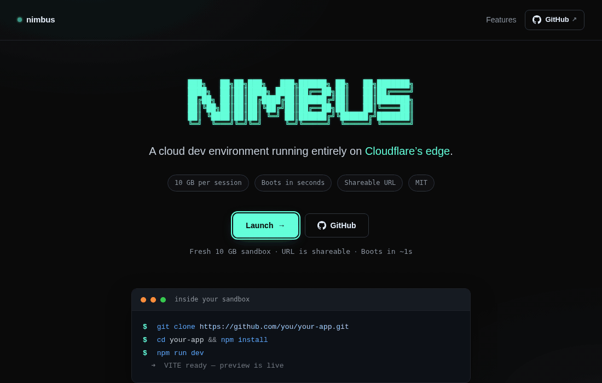
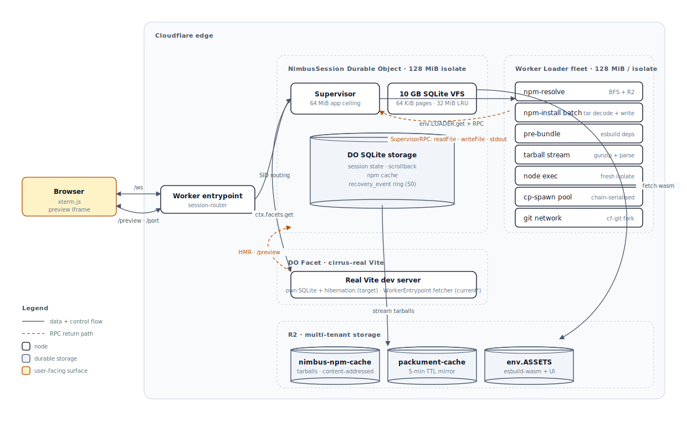
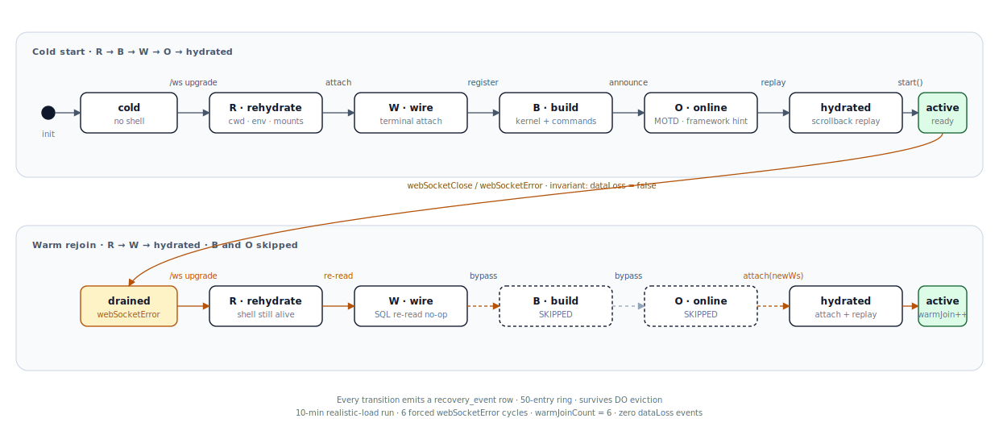
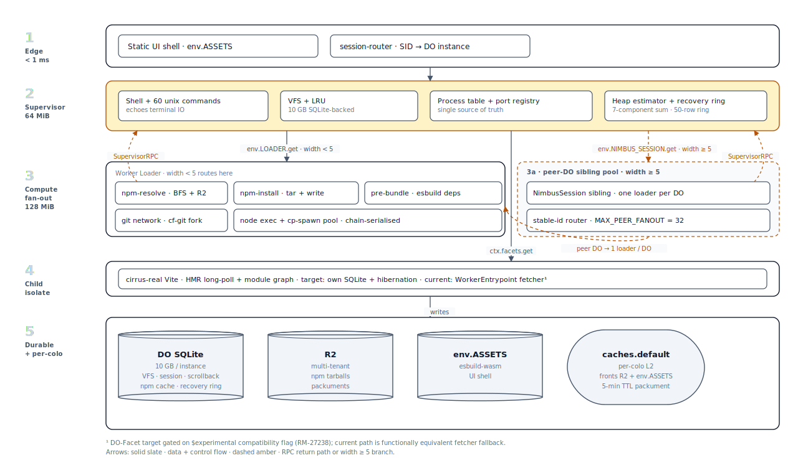

# Nimbus

A browser-native cloud development environment, built on Cloudflare Durable Objects.

🌐 **Live:** https://nimbus.ashishkmr472.workers.dev



## What it does

Open a URL. You get a real shell, 60+ Unix commands, and a 10 GB filesystem that
survives every reconnect. `npm install` reaches the live registry. `node` runs
scripts and servers. `git clone` works over HTTPS. A Vite-compatible dev server
ships HMR to a preview iframe alongside the terminal.

The whole workspace lives inside one Cloudflare Durable Object — your supervisor —
which fans out compute to ephemeral Worker Loader isolates and to a stateful DO
Facet running Vite. Storage is SQLite-backed and durable. The supervisor is the
single source of truth for the filesystem, npm cache, port registry, and process
table; everything else is replaceable.

The session URL is the identity of your DO instance. Bookmark it and your
filesystem is still there tomorrow. Share it and a teammate joins the same
process tree.

## Architecture

### System topology



Solid lines move data and control. Dashed amber lines carry RPC results back to
the supervisor. Worker Loader isolates do CPU-bound work — resolver BFS, tarball
gunzip, esbuild, child process dispatch, WASM execution — and stream their
results home through WorkerEntrypoint RPC. R2 fronts cross-tenant assets;
`caches.default` (not shown; per-colo L2) sits in front of R2 and `env.ASSETS`
for hot reads.

### Session lifecycle — R · B · W · O



Cold start runs all four phases. Warm rejoin after a `webSocketError` runs only
two — the shell, kernel, and 60 commands are still resident, so Build and Online
are skipped. The user sees a clean reconnect: cwd, env, scrollback, running
processes, and open files are all where they were left. Every transition writes
a row into a 50-entry `recovery_event` ring that itself survives DO eviction,
so a session can be replayed forensically after a crash.

### Layered architecture



Four layers, each owning a single concern. The supervisor (layer 2) runs inside
one Durable Object; layers 3 and 4 each get their own V8 isolate. The split
keeps the supervisor lean — it never executes user code directly, only routes
RPC — and lets CPU-heavy work run in isolates that die when the request does.

## Primitive scorecard

Every subsystem maps to one of four Cloudflare primitives. Current state matches
target everywhere except `cirrus-real` Vite, which is platform-gated.

| Subsystem | Target | Current | Why this primitive |
|---|---|---|---|
| `npm-resolve` (BFS) | Worker Loader | matches | Ephemeral fan-out; per-spec hash → stable LOADER ID; isolate dies when the work does |
| `npm-install` batch | Worker Loader | matches | Stateless extract + write; nothing to preserve between batches |
| `pre-bundle` (esbuild) | Worker Loader | matches | One isolate per dep; result streamed via ReadableStream-over-RPC |
| `tarball` decompression | Worker Loader | matches | Streaming tar parse; pure compute |
| `git` clone/fetch | Worker Loader | matches | isomorphic-git pre-bundled; no per-clone state |
| `cp-spawn` (child_process) | Worker Loader | matches | Fresh isolate per spawn |
| `wasm-runner` (WASI) | Worker Loader | matches | WebAssembly modules execute under a snapshot_preview1 shim in an ephemeral isolate |
| **`cirrus-real` Vite** | **DO Facet** | **fetcher-fallback¹** | Best fit for stateful in-memory thread pool sharing one host; target adds per-instance own-SQLite + hibernation. `/preview/` behaviour is identical |
| Session state (cwd · env · mounts · scrollback) | DO SQLite | matches | Source of truth for everything that must outlive `webSocketError` |
| Recovery event ring | DO SQLite | matches | 50-entry bounded ring; survives DO eviction |
| npm tarball + packument cache | R2 | matches | Cross-tenant L3 cache; capacity past one DO's 10 GB |
| Per-colo L2 (packument · tarball · esbuild-wasm) | `caches.default` | matches | Hot-read cache fronting R2 + `env.ASSETS` |
| Supervisor IPC | WorkerEntrypoint RPC | matches | Promise pipelining; ReadableStream-over-RPC bypasses the 32 MiB structured-clone limit |
| Two-tier fan-out | Worker Loader + DO peer pool | matches | Routes by width: in-DO for small N, peer-DO sibling pool for large N |

¹ `cirrus-real` Vite currently runs as `kind = 'fetcher-fallback'` — a stateless
`WorkerEntrypoint` default export that shares module-scope vite-bootstrap state —
instead of the `ctx.facets.get(name, {class})` DO-Facet target. The DO-Facet path
needs `worker.getDurableObjectClass()`, which only ships under the `$experimental`
compatibility flag, and Cloudflare's deploy validator rejects `$experimental` for
non-CF-team accounts (error 10021). When the flag promotes to GA, a runtime
feature-probe in `src/facets/cirrus-real.ts` switches paths with no code change.

## Quickstart

```bash
git clone https://github.com/AshishKumar4/Nimbus.git
cd Nimbus
bun install
bun run dev      # wrangler dev --ip 0.0.0.0 --port 8787
```

Open http://localhost:8787, click **Launch**, and you are inside your own DO.
The Launch button mints a session ID and 302s to `/s/<id>/`. That URL is the
identity of your Durable Object — bookmark it, share it, or come back to it
in a week.

## What works inside a Nimbus session

Verified against the live deploy by behavioral probes in `tests/behavioral/`.

| Capability | Status | Probe |
|---|:---:|---|
| Vite SPA dev server (no CF plugin) — `cd ~/app && npm install && npm run dev` | ✅ | `end-to-end-workflow.mjs` |
| Pure Workers (`wrangler dev`) — small single-file workers | ✅ | `wrangler-dev-clone.mjs` |
| Workers + Static Assets (`assets:` field in `wrangler.jsonc`) | ✅ | `support-matrix.mjs` |
| `npx <pkg>` — first-class shebang strip + auto-install fallback | ✅ | `primitives-extension/npx-vite.mjs` |
| `.bin` shim handler — `node_modules/.bin/*` resolves and executes | ✅ | `primitives-extension/bin-tsc.mjs` |
| `process.env` contract — `PORT`, `HOST`, `NIMBUS_SESSION_ID` auto-injected | ✅ | `primitives-extension/process-env-port.mjs` |
| Binary file round-trip — `writeFileSync` / `readFileSync` preserve bytes | ✅ | `binary-fs/writeFileSync-binary.mjs` |
| `wasm-runner` — execute `.wasm` modules via the shell command | ✅ | `wasm-runner/hand-crafted-add.mjs` |
| WASI snapshot_preview1 — `fd_write`, `args`, `env`, `proc_exit`, `random_get`, `clock` | ✅ | `wasi/*.mjs` |
| Markflow-class install — `~617` deps, then `npm run dev` reaches preview | ✅ | `large-install.mjs` |
| `git clone` over HTTPS (small + Nimbus-sized repos) | ✅ | `git-clone.mjs` |
| Session recovery — `webSocketError` → reconnect → state preserved | ✅ | `session-recovery.mjs` |
| Astro / Next.js | ❌ | `support-matrix.mjs` — CLIs not registered as shell commands; `npm run dev` exits with command-not-found and a loud diagnostic |
| Vite + `@cloudflare/vite-plugin` | ❓ | uses `getPlatformProxy()` + a workerd subprocess that the facet runtime doesn't expose |
| Cloudflare Pages | ❓ | no `wrangler pages dev` handler; `functions/` layout not recognized |
| Nuxt · Remix · SvelteKit | ❓ | SvelteKit's `vite dev` should fall through to row 1 with `node_modules` present, but is not probed |

Full evidence + per-row probe paths in
[`tests/SUPPORT-MATRIX.md`](./tests/SUPPORT-MATRIX.md). Run
`bun test:behavioral` against the live deploy to re-verify any row.

## Performance

Measured against the live deploy.

| Cache layer | Speedup vs cold (median) | Notes |
|---|---:|---|
| L2 packument (`caches.default`) | **11.0×** | 5-min TTL mirroring R2 customMetadata |
| L2 tarball | **9.2×** | Eternal · content-addressed |
| L2 esbuild-wasm | **16.0×** | Eternal · content-addressed; ~12 MiB transfer dropped per facet boot |

| Fan-out site | Speedup vs serial baseline | Topology |
|---|---:|---|
| `npm install` batch (N = 8) | **5.54×** (best of 5.09–5.94) | Peer-DO sibling pool with stable-id router |
| Resolver fan-out (vite · webpack · drizzle-orm · express · zod) | **2.26× avg** (peak 3.16× drizzle-orm) | Frontier coordinator; in-DO loader pool |

| Operation | Wall time | Conditions |
|---|---:|---|
| `git clone` 1 600-file repo | 12–17 s | HTTPS via cf-git fork |
| `npm install zod` (cold session) | ~6 s | Resolver, fetch, tar decode, VFS write |
| `node -e 'console.log(…)'` (warm) | 102–152 ms | Fresh Worker Loader isolate per call |
| Vite hot reload | 302 ms median | Inside the bundled Vite dev server |

## Tests

`tests/behavioral/` contains black-box probes that drive a real session via
`POST /new` + WebSocket terminal. Run the whole cohort against the live deploy:

```bash
BASE=https://nimbus.ashishkmr472.workers.dev bun test:behavioral
```

Or just one probe:

```bash
BASE=https://nimbus.ashishkmr472.workers.dev bun tests/behavioral/large-install.mjs
```

## License + author

MIT. Built by [Ashish Kumar Singh](https://github.com/AshishKumar4) on top of
[LIFO OS](https://github.com/lifo-sh/lifo) by [Sanket Sahu](https://github.com/sanketsahu),
which seeded the shell interpreter, coreutils, and Node.js shim (MIT). The
Cloudflare-native primitives — Durable Objects with SQLite storage, Worker
Loaders, DO Facets, R2, `caches.default`, and WorkerEntrypoint RPC — are the
architectural backbone.
