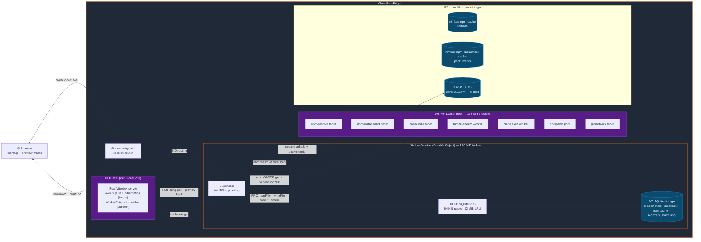
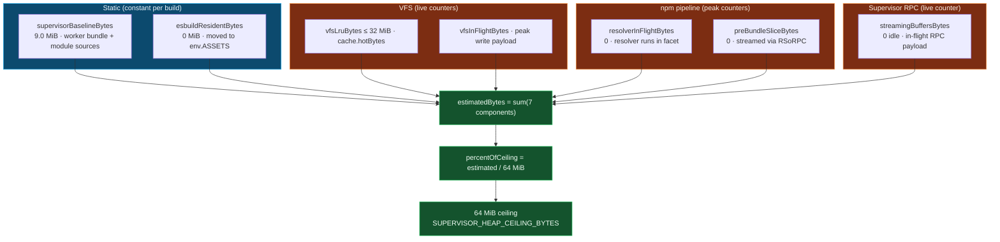
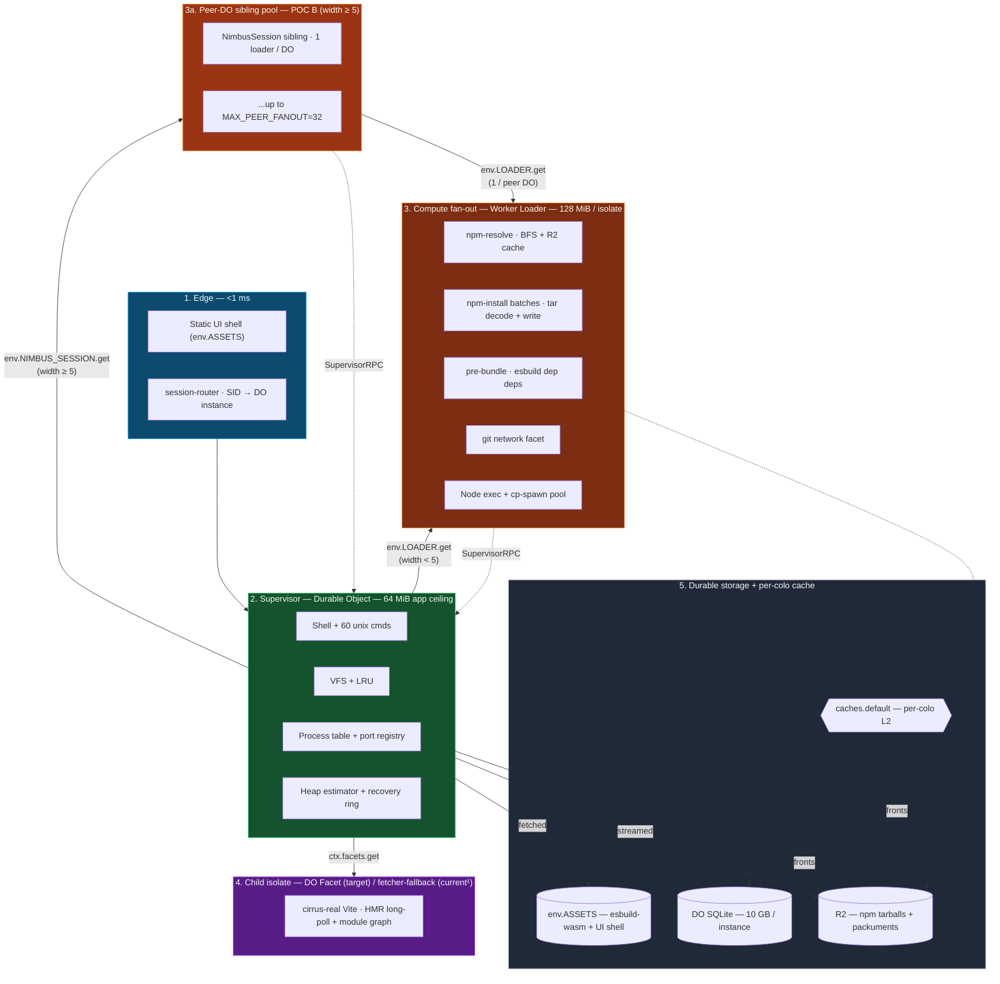

# Nimbus

A browser-native cloud development environment on Cloudflare Durable Objects.

**Live demo: 🌐 https://nimbus.ashishkmr472.workers.dev**

## What it does

Nimbus runs a complete dev workspace inside a single Cloudflare Durable Object: a real shell with 60+ Unix commands, `npm install` against the live registry, `node` for scripts and servers, `git clone` over HTTPS, and a Vite-compatible dev server with HMR. Storage is a 10 GB SQLite-backed virtual filesystem that survives session reconnects. Compute fans out across Worker Loader isolates (stateless, ephemeral) and DO Facets (stateful children); the supervisor DO is the single source of truth. Every session is a shareable URL — open it from any browser and you're inside the same filesystem and process tree as the previous reconnect.

## Architecture

### System topology



The supervisor DO is the single source of truth (filesystem, npm cache, port registry, process table). Worker Loader isolates handle CPU-bound work (resolver BFS, tarball decompression, esbuild, child process dispatch); results stream back via WorkerEntrypoint RPC.

### Session lifecycle (R-B-W-O)

```mermaid
stateDiagram-v2
    direction LR
    [*] --> cold

    cold --> rehydrate: /ws upgrade<br/>(no shell)
    rehydrate --> wire: load cwd · env ·<br/>mounts · scrollback
    wire --> build: terminal attached<br/>scrollback replayed
    build --> online: kernel + shell built<br/>commands registered
    online --> hydrated: MOTD + framework hint<br/>(cold-only)
    hydrated --> active: shell.start()<br/>ws.send({type:'ready'})

    active --> drained: webSocketClose<br/>or webSocketError

    drained --> rehydrate_warm: /ws upgrade<br/>(shell still alive)
    rehydrate_warm --> wire_warm: SQL re-read<br/>(no-op; live state OK)
    wire_warm --> hydrated_warm: terminal.attach(newWs)<br/>+ scrollback replay
    hydrated_warm --> active: warmJoinCount++<br/>(Phase B + O SKIPPED)

    state rehydrate_warm <<choice>>
    state wire_warm <<choice>>
    state hydrated_warm <<choice>>
```



Cold-start runs **R → B → W → O → hydrated**; warm rejoin runs **R → W → hydrated**. Every transition is recorded in a 50-entry `recovery_event` ring with `dataLoss=false` as an architectural invariant. A 10-minute realistic-load run with 6 forced `webSocketError` cycles measures `warmJoinCount=6, zero dataLoss events`.

### Memory budget (64 MiB ceiling)



Invariant: `sum(breakdown.*) === estimatedBytes` at every poll. Idle: 9.0 MiB. Peak under 10-minute realistic load (vite running, 297 preview fetches, 19 shell commands, 6 WS-kill cycles): **15.24 MiB / 64.0 MiB (23.8%)** with 275-byte heap drift.

### Layered architecture



Layer 3 (Worker Loader) and layer 4 (DO Facet) are independent V8 isolates with their own 128 MiB caps. Only layer 2 (the supervisor) sees the entire request chain; the 64 MiB application ceiling is the architectural promise of the rebuild — measured peak under load is 23.8% of ceiling.

## Primitive scorecard

Every subsystem maps to one of four Cloudflare primitives. The current state matches the target everywhere except cirrus-real Vite, which is platform-gated.

| Subsystem | Target primitive | Current (prod) | Why this primitive |
|---|---|---|---|
| `npm-resolve` (BFS) | Worker Loader | matches | Best for ephemeral fan-out; per-spec hash → stable LOADER ID; isolate dies when work completes |
| `npm-install` batch | Worker Loader | matches | Stateless extract+write; no per-batch state to preserve |
| `pre-bundle` (esbuild) | Worker Loader | matches | One isolate per dep; result streamed via ReadableStream-over-RPC |
| `tarball` decompression | Worker Loader | matches | Streaming tar parse; pure compute |
| `git` clone/fetch | Worker Loader | matches | isomorphic-git pre-bundled; no per-clone state survives |
| `cp-spawn` (child_process) | Worker Loader | matches | Per-spawn fresh isolate envelope; chain-serialized through one slot to avoid the 4-loader cap |
| **`cirrus-real` Vite** | **DO Facet** | **fetcher-fallback¹** | Best for stateful in-memory thread pool sharing one host; target buys per-instance own-SQLite + hibernation. User-visible /preview/ behaviour is identical |
| Session state (cwd · env · mounts · scrollback) | DO SQLite | matches | Source of truth for everything that must survive `webSocketError` |
| Recovery event ring + OOM forensics | DO SQLite | matches | Bounded 50-entry ring; survives DO eviction |
| npm tarball + packument cache | R2 | matches | Cross-tenant L3 cache; storage capacity beyond 1 DO's 10 GB |
| Per-colo L2 (packument + tarball + esbuild-wasm) | `caches.default` | matches | Hot-read cache fronting R2 + env.ASSETS |
| Supervisor IPC | WorkerEntrypoint RPC | matches | Promise pipelining; ReadableStream-over-RPC bypasses the 32 MiB structured-clone limit |
| Two-tier fan-out | Worker Loader + DO peer pool | matches | Routes by width: in-DO POC C (`<5`) for small N, peer-DO POC B (`≥5`) for large N |

¹ cirrus-real Vite currently runs `kind = 'fetcher-fallback'` (a stateless `WorkerEntrypoint` default export sharing module-scope vite-bootstrap state) instead of the `ctx.facets.get(name, {class})` DO-Facet target topology. The DO-Facet path requires `worker.getDurableObjectClass()`, which is only exposed under the `$experimental` compatibility flag; Cloudflare's deploy validator rejects `$experimental` for non-CF-team accounts (error code 10021). Unblocked by [RM-27238](https://jira.cfdata.org/browse/RM-27238) (Dynamic Worker Loader GA promotion); when it lands, the runtime feature-probe at `src/facets/cirrus-real.ts:start()` picks up the DO-Facet path with no Nimbus code change.

## Performance

All numbers below are measured against the live deploy. Sources: `audit/sections/*-retro.md`.

| Surface | Idle | Peak under load | Headroom |
|---|---:|---:|---:|
| Supervisor heap (64 MiB ceiling) | 9.00 MiB | 15.24 MiB | 76.2% |
| `recovery_event` ring | 0 | 6 ws-kill events / 10 min | bounded 50 |
| `dataLoss` events | 0 | 0 / 10 min · 6 cycles | invariant |

| Cache layer | Speedup vs cold (median) | Notes |
|---|---:|---|
| L2 packument (`caches.default`) | **11.0×** | 5-min TTL mirroring R2 customMetadata |
| L2 tarball | **9.2×** | Eternal · content-addressed |
| L2 esbuild-wasm bytes | **16.0×** | Eternal · content-addressed; ~12 MiB transfer avoided per facet boot |

| Fan-out site | Speedup vs serial baseline | Topology |
|---|---:|---|
| `npm install` batch (N=8) | **5.54×** (best of 5.09–5.94) | POC B peer-DO with stable-id router |
| Resolver fan-out (cohort: vite, webpack, drizzle-orm, express, zod) | **2.26× avg** (3.16× drizzle-orm peak) | Frontier coordinator; in-DO POC C |

| Operation | Wall time | Conditions |
|---|---:|---|
| `git clone` 1 600-file repo | 12–17 s | HTTPS over the cf-git fork; W7 writeBatchStream pipeline |
| `npm install zod` (cold session) | ~6 s | Includes resolver, fetch, tarball decode, VFS write |
| `node -e 'console.log(…)'` (warm) | 102–152 ms | Per-call fresh Worker Loader isolate |
| Vite hot reload (W10 · wrangler-dev) | 302 ms median | <500 ms target |

The supervisor's idle baseline (9.00 MiB) and 10-minute peak (15.24 MiB) are both well below the 64 MiB application ceiling. The 4-loaders-per-method-context V8 cap is structurally avoided across all hot paths via either chain-serialization (cp-spawn) or peer-DO routing (npm-install).

## Quickstart

```bash
git clone https://github.com/AshishKumar4/Nimbus.git && cd Nimbus
bun install
bun run dev      # wrangler dev --ip 0.0.0.0 --port 8787
# Open http://localhost:8787 → Launch → terminal + preview
```

The `Launch` button mints a session ID and 302s to `/s/<id>/`. That URL is the sole identity of your Durable Object — bookmark it to come back, or share it for a teammate to join the same filesystem and process tree.

## License + author

MIT. Built by [Ashish Kumar Singh](https://github.com/AshishKumar4) on top of [LIFO OS](https://github.com/lifo-sh/lifo) by [Sanket Sahu](https://github.com/sanketsahu) (the shell interpreter, coreutils, and Node.js shim seed; MIT). Cloudflare-native primitives — Durable Objects with SQLite storage, Worker Loaders, DO Facets, R2, `caches.default`, WorkerEntrypoint RPC — are the architectural backbone.
