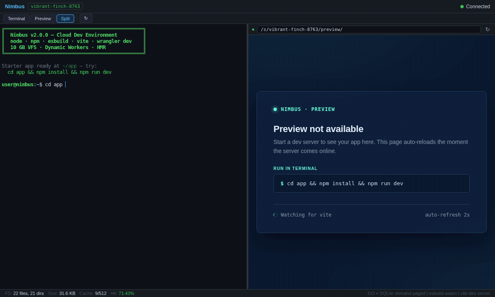
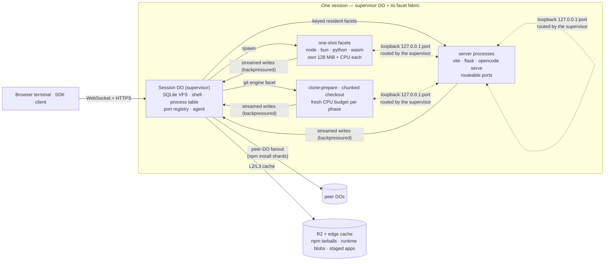
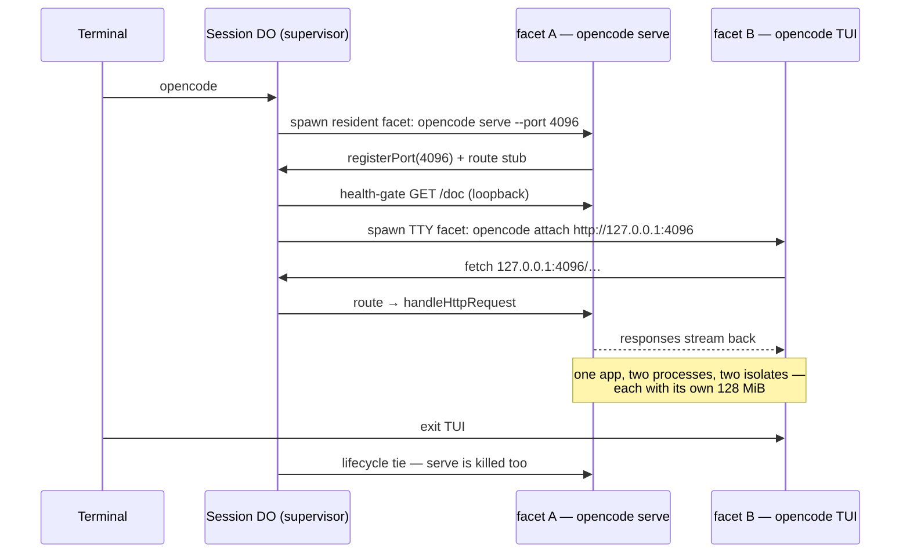

# Nimbus

> This is a hobby/research project to see how far can we push Cloudflare durable objects to. Although it works, there are several rough edges, and I only work on it in my spare time. This README is edited and maintained with Claude (AI) and presented as-is.

**Give every agent its own computer.** Nimbus is a free and open-source, POSIX-like cloud OS that runs entirely on Cloudflare's network — instant, effectively unlimited, isolate-native sandboxes. Open a URL (or call the SDK) and get a real shell with `node` + `bun` (Cloudflare workerd `nodejs_compat` runtime), `npm`, `git`, real `python` (Pyodide-compiled CPython 3.13), real `ruby` (ruby.wasm 3.3), real `clang` (LLVM 8 → `wasm32-wasi-nimbus`), and 60+ Unix commands. No Docker. No containers. No VMs. No image pull.

🌐 **Try it now:** https://nimbus-os.dev



## Free and open source alpha

Nimbus is an MIT-licensed hobby alpha. The repo, SDK, Worker runtime, React
bindings, CLI, and config helpers are public and self-hostable.

The hosted demo at https://nimbus-os.dev is free for evaluation.
It is not a managed service, has no SLA, may be rate-limited or reset, and
should not be used for secrets or production data. For real workloads, deploy
Nimbus to your own Cloudflare account with `npx create-nimbus-app`.

## Why Nimbus

Cloud dev environments today are either heavy VMs (slow to start, expensive to idle) or browser sandboxes that can't run real toolchains. Nimbus is different:

- **Linux-like userland.** `node` and `bun` over the Cloudflare workerd `nodejs_compat` runtime (the same V8 your Workers code runs on — not a JS interpreter stub, but also not the upstream Node/Bun binaries: it's the workerd-compatibility surface). Real `git clone` over HTTPS via isomorphic-git. Real `npm install` against the live npm registry. Real `python` (Pyodide-compiled CPython 3.13, WebAssembly), real `ruby` (ruby.wasm 3.3, WebAssembly), real `clang` (LLVM 8 with modern wasi-libc, compiles C to `wasm32-wasi-nimbus` in-session).
- **Fast Worker startup.** Each session is a Cloudflare Durable Object backed by SQLite. Session create → first command runs in ~0.6 s median (measured with the ComputeSDK TTI methodology, N=100, 100% success). No VM boot. No image pull.
- **Built for agents.** Every agent can mint its own sandbox through the SDK — sandboxes are cheap enough to create per-task, and 100 simultaneous creates succeed without a warm pool.
- **128 MiB is a segment, not a ceiling.** Every isolate on Workers is capped at 128 MiB — so Nimbus treats processes the way an OS treats them: heavy apps span *multiple* isolates. Each process gets its own isolate (its own memory and CPU budget), wired together over the session's loopback network. opencode runs this way: its server and TUI are two cooperating processes in two isolates.
- **$0 when idle.** Sessions hibernate. Your filesystem persists. Come back tomorrow, the URL still works, your files are still there.
- **The URL is the session.** Bookmark it, share it, hand it to a teammate — they join the same filesystem.
- **10 GB of persistent storage per session**, SQLite-backed, durable across reconnects and DO eviction.

## Architecture (high level)

One session = one Cloudflare Durable Object (the **supervisor**) plus a fabric of Worker Loader isolates (**facets**). The supervisor owns the durable state: the SQLite-backed filesystem, the shell, the process table, and the port registry. Every process runs in its own facet isolate with its own 128 MiB memory and CPU budget — one-shot facets for commands, resident keyed facets for servers, and a dedicated git engine. Facets write back through a streamed, credit-backpressured RPC pipeline so a parallel `npm install` or an 84,000-file checkout can't overwhelm the supervisor.


```mermaid
flowchart LR
  C[Browser terminal · SDK client] -- "WebSocket + HTTPS" --> DO

  subgraph session ["One session — supervisor DO + its facet fabric"]
    DO["Session DO (supervisor)<br/>SQLite VFS · shell · process table<br/>port registry · agent"]
    DO -- spawn --> F1["one-shot facets<br/>node · bun · python · wasm<br/>own 128 MiB + CPU each"]
    DO -- "keyed resident facets" --> F2["server processes<br/>vite · flask · opencode serve<br/>routeable ports"]
    DO -- "git engine facet" --> F3["clone-prepare · chunked checkout<br/>fresh CPU budget per phase"]
    F1 & F2 & F3 -- "streamed writes (backpressured)" --> DO
    F1 & F2 & F3 <-. "loopback 127.0.0.1:port<br/>routed by the supervisor" .-> F2
  end

  DO -- "peer-DO fanout<br/>(npm install shards)" --> P[("peer DOs")]
  DO -- "L2/L3 cache" --> R2[("R2 + edge cache<br/>npm tarballs · runtime blobs · staged apps")]
```

Loopback networking is real: a process can `curl http://127.0.0.1:5000/` and reach a server running in a *different* isolate — the supervisor's port registry routes it, the same path the browser preview uses. That's what lets one app span multiple isolates. Here is opencode running as a two-process app:


```mermaid
sequenceDiagram
  participant T as Terminal
  participant S as Session DO (supervisor)
  participant A as facet A — opencode serve
  participant B as facet B — opencode TUI

  T->>S: opencode
  S->>A: spawn resident facet: opencode serve --port 4096
  A->>S: registerPort(4096) + route stub
  S->>A: health-gate GET /doc (loopback)
  S->>B: spawn TTY facet: opencode attach http://127.0.0.1:4096
  B->>S: fetch 127.0.0.1:4096/…
  S->>A: route → handleHttpRequest
  A-->>B: responses stream back
  Note over A,B: one app, two processes, two isolates —<br/>each with its own 128 MiB
  T->>B: exit TUI
  S->>A: lifecycle tie — serve is killed too
```

## What works today

Covered by a behavioral probe suite in `tests/behavioral/`. Run it yourself against a live deployment; see [Tests](#tests).

| Capability | Status |
|---|:---:|
| Real shell, 60+ Unix commands, persistent 10 GB filesystem | ✅ |
| `node`, `bun` via Cloudflare workerd `nodejs_compat` (V8 + Node-API shim, not the upstream binaries) | ✅ |
| `python` / `python3` — Pyodide-based CPython 3.13 (script + `-c` + `-m` + stdlib) | ✅ |
| `ruby` / `ruby3` — ruby.wasm-based Ruby 3.3 (script + `-e` + `-r` + stdlib) | ✅ |
| `clang` — LLVM 8 → `wasm32-wasi-nimbus`, modern wasi-libc sysroot default, multi-TU + user headers + `fopen` | ✅ |
| Interactive REPLs — `python`, `ruby`, `node`, `bun` (see [REPL](#repl) for state semantics) | ✅ |
| `npm install` against the live registry, with cross-session L2 cache | ✅ |
| npm alias dependencies such as `alias: "npm:<pkg>@<version>"` | ✅ |
| `git clone` over HTTPS — chunked checkout engine; facebook/react (7,300 files) in ~28 s; 84,000-file worktrees materialize via bounded continuation | ✅ |
| In-session loopback networking — `curl http://127.0.0.1:<port>` reaches servers in other isolates; `node server.js` auto-promotes to a routeable resident process | ✅ |
| Streaming HTTP through the fabric — SSE / chunked bodies flow live (per-chunk) across the isolate boundary, loopback and external preview alike | ✅ |
| Unix permissions groundwork — durable `st_mode`, real `chmod` (octal + symbolic), exec-bit enforcement: `./binary` runs only if executable (`Permission denied`, exit 126 otherwise), generic `#!` shebang dispatch | ✅ |
| Multi-isolate processes — client/server apps span facets (opencode runs as a serve + attach pair, each in its own isolate) | Alpha |
| Vite SPA dev server — full HMR to the preview iframe | ✅ |
| `wrangler dev` for single-file Workers; Workers + Static Assets | ✅ |
| Programmatic sandbox SDK — exec/files/runtimes/processes/ports/Proteus-style tools | ✅ |
| JS agent CLI primitives — env/home, npm/npx, `child_process.spawn`/`exec`/`execFile`, piped stdio, streams, logs | ✅ |
| Foreground attached npm-bin TTY tabs — stdin, resize, ANSI output, clean exit; Pi official installer and npm path probed | Alpha |
| Python package workflows — `pip`, PyPI pure wheels, requirements/constraints, curated pure source artifacts, declared Pyodide startup-module packages, Flask, `python -m flask run`, `python -m http.server` preview | Alpha |
| Ruby package workflows — `gem`, `bundle`, pure gems, Rack/WEBrick preview | Alpha |
| Session Agent — editor-workspace chat with Cloudflare OAuth / Workers AI and sandbox tools | ✅ |
| `npx <pkg>` — first-class shebang + auto-install fallback | ✅ |
| `node_modules/.bin/*` resolves and executes | ✅ |
| Binary file round-trip via `fs.writeFileSync` / `readFileSync` | ✅ |
| Session recovery — WebSocket drop → reconnect preserves cwd, env, files | ✅ |
| WASI preview1 — 45 of 46 spec functions; outbound TCP via `path_open('/dev/tcp/<host>/<port>')` (JSPI); full `poll_oneoff` (fd / clock / socket subscriptions) | ✅ |
| `wasi-threads` / pthreads — mutex, condvar, `pthread_join`, TLS, barriers, semaphores; cooperative, never parallel | ✅ ([how](docs/wasi-threads.md)) |

### Status: alpha

Nimbus is under active development. Current framework support is:

- **Stable:** Vite + React, the Cloudflare Vite Plugin, single-file Workers, Workers with Static Assets, npm + git workflows, Python and Ruby scripts, clang C compilation (single-file and multi-file).
- **Vite-based frameworks:** Astro, SvelteKit, and Remix/React Router use the Vite path. Nuxt has Vite/Nitro caveats.
- **Unfinished OS work:** broader Pyodide/Nimbus extension artifact catalogs beyond declared packages, complete upstream `pip`/Bundler CLI parity, opencode TUI first-frame rendering (the serve half boots, answers readiness, and streams SSE; the attach half's boot still trips a supervisor memory reset under investigation), index-pack CPU headroom for 75,000+-object clones (fetch can exceed the per-invocation CPU budget on repos like microsoft/TypeScript), full POSIX PTY parity, live filesystem bridges for every long-running runtime, and permission *enforcement* beyond the exec bit (uid/gid ownership, `EACCES` on read/write, real `umask`/`chown` — designed, not yet implemented).
- **Active research, mechanism proven live:** real `fork()`/`exec()` for compiled binaries over the isolate fabric via Binaryen Asyncify — execution-state capture, parent/child divergence, and grandchild forks all validated inside a production facet (fork of a 16 MiB image in under 1 ms). The acid test passed: unmodified GNU bash 5.2 runs live (`nimbus install bash`) with fork/pipes/subshells/command substitution, plus a BusyBox coreutils set (ls, cat, cp, mv, rm, mkdir, grep, sed, awk, find, wc, sort, chmod, ...) compiled to wasm32-wasi and exec'd as real external commands on bash's PATH, under S2a permission enforcement.
- **Explicit limits:** Next.js dev server, Cloudflare Pages (`wrangler pages dev`), Docker, apt, native Linux ELF execution, native platform-only CLI shards, native Linux Python wheels, native Ruby extensions without Nimbus-compatible artifacts, and raw public TCP listeners. A single session allows one active terminal owner at a time; sequential reconnect/share preserves filesystem and shell state.

## Quickstart

### Try the live demo

```
1. Visit https://nimbus-os.dev
2. Click "Launch" — you'll be redirected to /s/<your-session-id>/
3. The URL is now your dev environment. Bookmark it.
```

You're in a real shell. Try:

```bash
node --version              # workerd nodejs_compat (V8 + Node-API shim)
git clone https://github.com/AshishKumar4/Markflow   # real git over HTTPS
cd Markflow && npm install  # real npm against registry.npmjs.org
npm run dev                  # vite dev server — preview in the iframe
```

The preview pane on the right is tabbed. It keeps Markdown preview, the default
app preview at `/s/<id>/preview/`, Worker preview, and live port previews
together. When a new process exposes a port, Nimbus opens and focuses that port
tab automatically.

Or write some C:

```bash
cat > hello.c <<EOF
#include <stdio.h>
int main(void) { printf("hello from clang on the edge\n"); return 0; }
EOF
clang hello.c -o hello.wasm
./hello.wasm
```

### Run it locally

```bash
git clone https://github.com/AshishKumar4/Nimbus.git
cd Nimbus
bun install
bun run dev      # wrangler dev --ip 0.0.0.0 --port 8787
```

Open http://localhost:8787 and click **Launch**.

## Embed Nimbus in your Workers project

Nimbus can be embedded as both an interactive dev environment and a
programmatic sandbox layer for backend Worker/Durable Object apps.

Use `@nimbus-sh/sdk/worker` for the deployed Worker embedder and
`@nimbus-sh/sdk` for programmatic sandboxes. The same SDK handle works
through a colocated Durable Object binding or through an authenticated
remote Nimbus deployment:

```bash
npx create-nimbus-app my-nimbus-worker
cd my-nimbus-worker
npm install
CLOUDFLARE_ACCOUNT_ID=<account-id> npx @nimbus-sh/cli setup cloudflare --name my-nimbus-worker
npx wrangler secret put JWT_SECRET
npx wrangler deploy
```

`setup cloudflare` creates the account-local R2 buckets Nimbus binds to
and seeds the runtime cache for Python, Ruby, and clang. If Wrangler
reports Cloudflare R2 error `10042`, enable R2 in the Cloudflare Dashboard
once for that account and rerun the setup command.

```ts
import { Nimbus } from '@nimbus-sh/sdk';
import { defineNimbusConfig } from '@nimbus-sh/config';

const nimbusConfig = defineNimbusConfig({
  sandboxes: {
    default: {
      root: '/home/user',
      tools: { namespace: 'sandbox', kind: 'sandbox' },
      runtimes: {
        preinstall: ['python', 'clang'],
        onDemand: true,
        allow: ['node', 'bun', 'npm', 'git', 'python', 'ruby', 'clang', 'shell'],
      },
    },
  },
});

export default {
  async fetch(_request: Request, env: Env) {
    const nimbus = Nimbus.fromEnv(env, nimbusConfig);
    const box = nimbus.sandbox('job-123', {
      tenant: 'acme',
      subject: 'agent',
    });

    const result = await box.exec('python -c "print(2 + 2)"');
    return Response.json(result);
  },
};
```

For a remote Nimbus deployment, mint a scoped token and connect by URL:

```ts
import { Nimbus, issueNimbusToken } from '@nimbus-sh/sdk';

const token = await issueNimbusToken(env, {
  tn: 'acme',
  sub: 'agent',
  scopes: ['sandbox:use'],
  sid: 'job-123',
});

const box = Nimbus.connect({
  endpoint: 'https://my-nimbus.workers.dev',
  token,
  config: nimbusConfig,
}).sandbox('job-123');
```

Useful programmatic calls:

```ts
await box.ready();                                      // headless session boot
await box.files.write('/home/user/app/server.js', code);
await box.runtimes.ensure(['python', 'clang']);         // package-manager backed
await box.runCode('print(2 + 2)', { language: 'python', install: 'ifMissing' });
const proc = await box.startProcess('node --watch /home/user/app/server.js');
                                                        // returns a live pid, does not block
const port = await box.ports.expose(3000);              // /s/<id>/port/3000/
const provider = box.tools({ namespace: 'sandbox' });   // Proteus-style tools
```

Use `@nimbus-sh/sdk/flue` when an agent harness speaks Flue's sandbox
provider contract:

```ts
import { nimbusFlue } from '@nimbus-sh/sdk/flue';

const sandboxFactory = nimbusFlue(box);
const sessionEnv = await sandboxFactory.createSessionEnv({
  id: 'job-123',
  cwd: '/home/user',
});
```

Nimbus is a Cloudflare Worker/DO/WASM sandbox, not a Linux VM. It supports
owned VFS, shell, npm/npx, git, long-running HTTP-like processes, Python,
Ruby, clang-to-WASI, process logs, and port routing. It does not claim Docker,
apt, GPUs, custom Linux images, native Linux ELF execution, or raw TCP
listeners.

### Packages

| Package | What |
|---|---|
| [`@nimbus-sh/sdk`](packages/sdk) | Public SDK surface: Worker embedder (`@nimbus-sh/sdk/worker`), programmatic sandboxes (`@nimbus-sh/sdk/sandbox`), Flue connector (`@nimbus-sh/sdk/flue`), token mint/verify, typed errors, and session URL helpers. |
| [`@nimbus-sh/worker`](packages/worker) | Runtime package used by the SDK: `NimbusSession` DO, router, assets, runtimes, VFS, and auth internals. |
| [`@nimbus-sh/react`](packages/react) | `<NimbusTerminal />` React component. |
| [`@nimbus-sh/cli`](packages/cli) | `nimbus init`, `nimbus setup cloudflare`, `token mint`, and `runtime sync`. |
| [`create-nimbus-app`](packages/create-nimbus-app) | `npx create-nimbus-app` scaffold wrapper. |
| [`@nimbus-sh/config`](packages/config) | Typed `defineNimbusConfig()` and `buildNimbusWranglerConfig()` helpers. |

The live demo at https://nimbus-os.dev runs from
[`apps/hosted-demo`](apps/hosted-demo) and is the canonical reference embedder:
the same shape any external project ships.

## REPL

`python`, `ruby`, `node`, and `bun` launch interactive REPLs when given no arguments. There are two honest categories:

**Stateful (real interpreter, real persistence):**

- `python` / `python3` — drives Pyodide's `PyodideConsole` directly. Variables, functions, imports, multi-line blocks persist across submits. `>>> ` primary, `... ` continuation.
- `ruby` / `ruby3` — drives the long-lived ruby.wasm runtime. `irb`-style `irb> ` / `irb* ` prompts. Variables, methods, requires persist.

**Stateless emulation (workerd CSP-bounded):**

- `node` / `bun` — workerd's CSP blocks runtime `eval` and `new Function`, so we can't persist `var` / `let` / `const` declarations across submits the way upstream Node/Bun do. `console.log` and per-line side effects work; for stateful work, run a script (`node -e '<code>'` or `node script.js`). The banner says exactly this.

Press Ctrl-D or type `exit` / `.exit` to leave. Probes: `tests/behavioral/repl/` (13 probes covering exit semantics, prompts, stateful Python, error recovery).

## C compilation

`clang` compiles C to the `wasm32-wasi-nimbus` ABI in-session, then `wasm-ld` links. Both binaries run in a child-facet isolate on the same WASI layer every other non-node runtime uses, so `#include "your-header.h"` and `fopen("./data.txt", "r")` work.

What's wired today (v12 sysroot, currently deployed):

- Modern wasi-libc sysroot (binji-shape, derived from upstream wasi-sdk-19).
- Multi-translation-unit compile + link (`clang a.c b.c -o prog`).
- User headers in cwd or under `-I<dir>`.
- `fopen("...", "r" | "w" | "a")` against VFS paths (relative + absolute).
- 128-bit math intrinsics (`__muloti4`, `__divti3`) provided via linked `libclang_rt.builtins-wasm32.a`.
- OS-grade binary dispatch: `clang` marks linked executables `0o755`, so `clang hello.c -o hello && ./hello` runs directly — no wrapper, no manual step. `chmod -x hello && ./hello` honestly fails with `Permission denied` (exit 126); non-wasm files with the exec bit dispatch via `#!` shebang or fall back to `sh`.

The stdio/atexit behavior is covered by the v13 probes in `tests/behavioral/clang-stdio/`. Sysroot selection is catalog-driven in R2, so after a catalog flip, verify the live deploy with those probes.

Probes: `tests/behavioral/clang/`, `tests/behavioral/clang-includes/`, `tests/behavioral/clang-stdio/`, `tests/behavioral/wasi-paths/`.

`-pthread` / `wasi-threads` programs run correctly but never in parallel: one core, one thread at a time. Build them with `--import-memory --shared-memory` and the futex shim — see [docs/wasi-threads.md](docs/wasi-threads.md).

## Performance

Measured against a live deployment (2026-07).

| Operation | Wall time |
|---|---|
| Session create → first command (TTI, ComputeSDK methodology, N=100) | 0.61 s median · 0.82 s P95 |
| 100 sandboxes created simultaneously (burst, all succeed) | 1.15 s median |
| `git clone` facebook/react (7,300 files) | ~28 s |
| `npm install` 611-package app (52,500 files, cold session) | ~165 s |
| `npm install zod` (cold session) | ~6 s |
| `node -e 'console.log(...)'` (warm) | 102–152 ms |
| Vite hot reload | 302 ms median |

Cross-session caching gives 9–16× speedups for warm package installs vs cold. Perf-regression probes in `tests/behavioral/perf-regression/` assert thresholds on every deploy.

## Session Agent

Every Nimbus session includes an Agent surface inside the editor workspace.
The center pane switches between the file editor and chat, while the terminal
and preview stay visible. The agent lives inside the same `NimbusSession`
Durable Object as the terminal, so it can use the same filesystem, shell,
runtime package manager, process table, logs, and preview ports.

The agent uses the AI SDK with Cloudflare Workers AI's OpenAI-compatible
endpoint and an optional AI Gateway name. User OAuth can spend the user's own
Cloudflare quota; owner-token fallback can spend the deployment owner's quota.
Responses stream into the chat UI, with thinking state, tool-call status,
tool inputs, and tool results rendered inline.

Configure OAuth when each user should spend their own Cloudflare quota. In
Cloudflare's **Create OAuth client** form, use:

- **Client Name:** `Nimbus Agent`
- **Response Type:** `Code`
- **Grant type:** `Authorization Code`
- **Token Authentication Method:** `None`
- **Redirect (Callback) URLs:** `https://<your-nimbus-host>/api/nimbus/oauth/callback`
- **Client URL:** `https://<your-nimbus-host>`

Nimbus uses Authorization Code + PKCE. User OAuth tokens are stored only in
encrypted, `HttpOnly`, `Secure`, `SameSite=Lax` browser cookies scoped to the
session URL. Nimbus does not persist user OAuth tokens in Durable Object
storage.

On the scopes step, select the narrow scopes needed for the Agent:

| Dashboard scope | Scope ID | Why |
|---|---|---|
| `User Details Read` | `user-details.read` | Read the connected user's profile. |
| `Account Settings Read` | `account-settings.read` | List accounts the user can choose from. |
| `Workers AI Write` | `ai.write` | Run Workers AI inference. |
| `AI Gateway Run` | `aig.run` | Required only when `NIMBUS_AGENT_GATEWAY_ID` is set. |

Do not select `Account API Gateway`; that is an API Shield permission, not
Cloudflare AI Gateway. Cloudflare exposes the current scope IDs in the
dashboard and through `GET /client/v4/oauth/scopes`.

Add non-secret values to `wrangler.jsonc` or generate them with
`@nimbus-sh/config`:

```jsonc
{
  "vars": {
    "NIMBUS_CF_OAUTH_CLIENT_ID": "<oauth-client-id>",
    "NIMBUS_CF_OAUTH_SCOPES": "<scope-id-1> <scope-id-2>",
    "NIMBUS_AGENT_MODEL": "@cf/moonshotai/kimi-k2.6",
    "NIMBUS_AGENT_GATEWAY_ID": "default"
  }
}
```

Store secrets with Wrangler:

```bash
npx wrangler secret put NIMBUS_AGENT_COOKIE_SECRET
```

For a deployment-owner fallback instead of user OAuth:

```jsonc
{
  "vars": {
    "NIMBUS_CLOUDFLARE_ACCOUNT_ID": "<account-id>",
    "NIMBUS_AGENT_MODEL": "@cf/moonshotai/kimi-k2.6",
    "NIMBUS_AGENT_GATEWAY_ID": "default"
  }
}
```

```bash
npx wrangler secret put NIMBUS_CLOUDFLARE_API_TOKEN
```

The owner token should have the Cloudflare permissions required by AI Gateway
and Workers AI for the model you choose.

Use [`apps/hosted-demo`](apps/hosted-demo) as the current code-backed reference. It
runs the live demo and exposes `/api/sdk-smoke` plus `/api/sdk-remote-smoke`,
which exercise both SDK transports against the deployed app.

## Tests

`tests/behavioral/` contains a large black-box probe suite that drives a real session via `POST /new` + WebSocket. Probes assert real user-visible behavior -- structural-only assertions (regex on a bundle, HTTP 200 alone) are not accepted as pass criteria. See `tests/behavioral/PROBE-QUALITY.md` for the contract.

Run them all against the live deploy:

```bash
BASE=https://nimbus-os.dev bun test:behavioral
```

Or just one probe:

```bash
BASE=https://nimbus-os.dev bun tests/behavioral/clang-stdio/new/multi-printf-no-fflush.mjs
```

## License and credits

Nimbus is MIT licensed. See [`LICENSE`](LICENSE).

Built by [Ashish Kumar Singh](https://github.com/AshishKumar4) on top of
[LIFO OS](https://github.com/lifo-sh/lifo) by
[Sanket Sahu](https://github.com/sanketsahu), which seeded the shell
interpreter, coreutils, and Node.js shim. See [`NOTICE.md`](NOTICE.md) for
third-party credits and runtime license notes.

Contributions are welcome. Start with [`CONTRIBUTING.md`](CONTRIBUTING.md)
and open an issue or PR at https://github.com/AshishKumar4/Nimbus.
