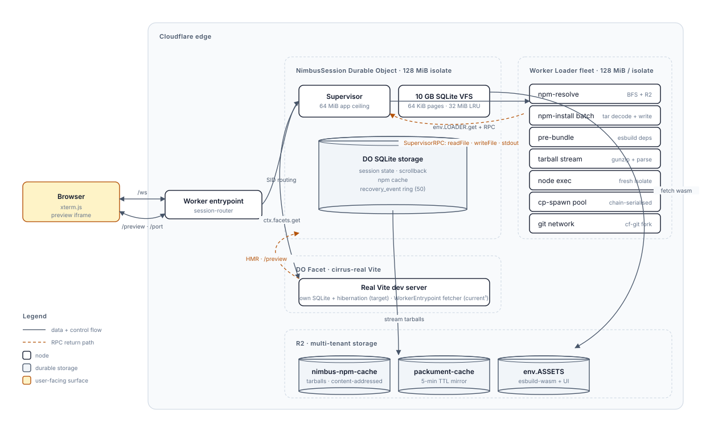
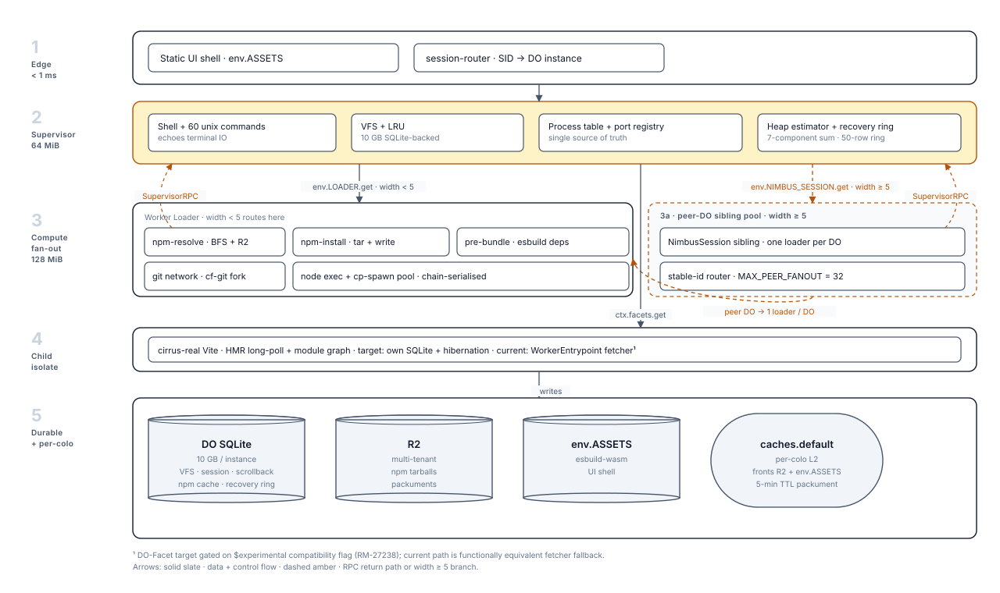

# Nimbus

A free and open-source Linux-like development environment that runs entirely on Cloudflare's edge. Open a URL, get a real shell with `node` + `bun` (Cloudflare workerd `nodejs_compat` runtime), `npm`, `git`, real `python` (Pyodide-compiled CPython 3.13), real `ruby` (ruby.wasm 3.3), real `clang` (LLVM 8 → wasm32-wasi), and 60+ Unix commands. No Docker. No containers. No cold-start wait.

🌐 **Try it now:** https://nimbus.ashishkumarsingh.com


## Free and open source alpha

Nimbus is an MIT-licensed hobby alpha. The repo, SDK, Worker runtime, React
bindings, CLI, and config helpers are public and self-hostable.

The hosted demo at https://nimbus.ashishkumarsingh.com is free for evaluation.
It is not a managed service, has no SLA, may be rate-limited or reset, and
should not be used for secrets or production data. For real workloads, deploy
Nimbus to your own Cloudflare account with `npx create-nimbus-app`.

## Why Nimbus

Cloud dev environments today are either heavy VMs (slow to start, expensive to idle) or browser sandboxes that can't run real toolchains. Nimbus is different:

- **Linux-like userland.** `node` and `bun` over the Cloudflare workerd `nodejs_compat` runtime (the same V8 your Workers code runs on — not a JS interpreter stub, but also not the upstream Node/Bun binaries: it's the workerd-compatibility surface). Real `git clone` over HTTPS via isomorphic-git. Real `npm install` against the live npm registry. Real `python` (Pyodide-compiled CPython 3.13, WebAssembly), real `ruby` (ruby.wasm 3.3, WebAssembly), real `clang` (LLVM 8 with modern wasi-libc, compiles C to wasm32-wasi in-session).
- **Sub-500ms cold start.** Each session is a Cloudflare Durable Object backed by SQLite. No VM boot. No image pull.
- **$0 when idle.** Sessions hibernate. Your filesystem persists. Come back tomorrow, the URL still works, your files are still there.
- **The URL is the session.** Bookmark it, share it, hand it to a teammate — they join the same filesystem.
- **10 GB of persistent storage per session**, SQLite-backed, durable across reconnects and DO eviction.

## Embed Nimbus in your Workers project

Nimbus can be embedded as both an interactive dev environment and a
programmatic sandbox layer for backend Worker/Durable Object apps.

Use `@nimbus-sh/sdk/worker` for the deployed Worker embedder and
`@nimbus-sh/sdk` for programmatic sandboxes. The same SDK handle works
through a colocated Durable Object binding or through an authenticated
remote Nimbus deployment:

```bash
npx create-nimbus-app my-nimbus-worker
cd my-nimbus-worker
npm install
CLOUDFLARE_ACCOUNT_ID=<account-id> npx @nimbus-sh/cli setup cloudflare --name my-nimbus-worker
npx wrangler secret put JWT_SECRET
npx wrangler deploy
```

`setup cloudflare` creates the account-local R2 buckets Nimbus binds to
and seeds the runtime cache for Python, Ruby, and clang. If Wrangler
reports Cloudflare R2 error `10042`, enable R2 in the Cloudflare Dashboard
once for that account and rerun the setup command.

```ts
import { Nimbus } from '@nimbus-sh/sdk';
import { defineNimbusConfig } from '@nimbus-sh/config';

const nimbusConfig = defineNimbusConfig({
  sandboxes: {
    default: {
      root: '/home/user',
      tools: { namespace: 'sandbox', kind: 'sandbox' },
      runtimes: {
        preinstall: ['python', 'clang'],
        onDemand: true,
        allow: ['node', 'bun', 'npm', 'git', 'python', 'ruby', 'clang', 'shell'],
      },
    },
  },
});

export default {
  async fetch(_request: Request, env: Env) {
    const nimbus = Nimbus.fromEnv(env, nimbusConfig);
    const box = nimbus.sandbox('job-123', {
      tenant: 'acme',
      subject: 'agent',
    });

    const result = await box.exec('python -c "print(2 + 2)"');
    return Response.json(result);
  },
};
```

For a remote Nimbus deployment, mint a scoped token and connect by URL:

```ts
import { Nimbus, issueNimbusToken } from '@nimbus-sh/sdk';

const token = await issueNimbusToken(env, {
  tn: 'acme',
  sub: 'agent',
  scopes: ['sandbox:use'],
  sid: 'job-123',
});

const box = Nimbus.connect({
  endpoint: 'https://my-nimbus.workers.dev',
  token,
  config: nimbusConfig,
}).sandbox('job-123');
```

Useful programmatic calls:

```ts
await box.ready();                                      // headless session boot
await box.files.write('/home/user/app/server.js', code);
await box.runtimes.ensure(['python', 'clang']);         // package-manager backed
await box.runCode('print(2 + 2)', { language: 'python', install: 'ifMissing' });
const proc = await box.startProcess('node --watch /home/user/app/server.js');
const port = await box.ports.expose(3000);              // /s/<id>/port/3000/
const provider = box.tools({ namespace: 'sandbox' });   // Proteus-style tools
```

Nimbus is a Cloudflare Worker/DO/WASM sandbox, not a Linux VM. It supports
owned VFS, shell, npm/npx, git, long-running HTTP-like processes, Python,
Ruby, clang-to-WASI, process logs, and port routing. It does not claim Docker,
apt, GPUs, custom Linux images, native Linux ELF execution, or raw TCP
listeners.

Use [`apps/hosted-demo`](apps/hosted-demo) as the current code-backed reference. It
runs the live demo and exposes `/api/sdk-smoke` plus `/api/sdk-remote-smoke`,
which exercise both SDK transports against the deployed app.

### Packages

| Package | What |
|---|---|
| [`@nimbus-sh/sdk`](packages/sdk) | Public SDK surface: Worker embedder (`@nimbus-sh/sdk/worker`), programmatic sandboxes (`@nimbus-sh/sdk/sandbox`), token mint/verify, typed errors, and session URL helpers. |
| [`@nimbus-sh/worker`](packages/worker) | Runtime package used by the SDK: `NimbusSession` DO, router, assets, runtimes, VFS, and auth internals. |
| [`@nimbus-sh/react`](packages/react) | `<NimbusTerminal />` React component. |
| [`@nimbus-sh/cli`](packages/cli) | `nimbus init`, `nimbus setup cloudflare`, `token mint`, and `runtime sync`. |
| [`create-nimbus-app`](packages/create-nimbus-app) | `npx create-nimbus-app` scaffold wrapper. |
| [`@nimbus-sh/config`](packages/config) | Typed `defineNimbusConfig()` and `buildNimbusWranglerConfig()` helpers. |

The live demo at https://nimbus.ashishkumarsingh.com runs from
[`apps/hosted-demo`](apps/hosted-demo) and is the canonical reference embedder:
the same shape any external project ships.

## Quickstart

### Try the live demo

```
1. Visit https://nimbus.ashishkumarsingh.com
2. Click "Launch" — you'll be redirected to /s/<your-session-id>/
3. The URL is now your dev environment. Bookmark it.
```

You're in a real shell. Try:

```bash
node --version              # workerd nodejs_compat (V8 + Node-API shim)
git clone https://github.com/AshishKumar4/Markflow   # real git over HTTPS
cd Markflow && npm install  # real npm against registry.npmjs.org
npm run dev                  # vite dev server — preview in the iframe
```

The preview iframe on the right shows your running app at `/s/<id>/preview/`.

Or write some C:

```bash
cat > hello.c <<EOF
#include <stdio.h>
int main(void) { printf("hello from clang on the edge\n"); return 0; }
EOF
clang hello.c -o hello.wasm
./hello.wasm
```

### Run it locally

```bash
git clone https://github.com/AshishKumar4/Nimbus.git
cd Nimbus
bun install
bun run dev      # wrangler dev --ip 0.0.0.0 --port 8787
```

Open http://localhost:8787 and click **Launch**.

## What works today

Covered by a behavioral probe suite in `tests/behavioral/`. Run it yourself against a live deployment; see [Tests](#tests).

| Capability | Status |
|---|:---:|
| Real shell, 60+ Unix commands, persistent 10 GB filesystem | ✅ |
| `node`, `bun` via Cloudflare workerd `nodejs_compat` (V8 + Node-API shim, not the upstream binaries) | ✅ |
| `python` / `python3` — Pyodide-based CPython 3.13 (script + `-c` + `-m` + stdlib) | ✅ |
| `ruby` / `ruby3` — ruby.wasm-based Ruby 3.3 (script + `-e` + `-r` + stdlib) | ✅ |
| `clang` — LLVM 8 → wasm32-wasi, modern wasi-libc sysroot default, multi-TU + user headers + `fopen` | ✅ |
| Interactive REPLs — `python`, `ruby`, `node`, `bun` (see [REPL](#repl) for state semantics) | ✅ |
| `npm install` against the live registry, with cross-session L2 cache | ✅ |
| `git clone` over HTTPS (small repos + 1 600-file repos in 12–17 s) | ✅ |
| Vite SPA dev server — full HMR to the preview iframe | ✅ |
| `wrangler dev` for single-file Workers; Workers + Static Assets | ✅ |
| Programmatic sandbox SDK — exec/files/runtimes/processes/ports/Proteus-style tools | ✅ |
| `npx <pkg>` — first-class shebang + auto-install fallback | ✅ |
| `node_modules/.bin/*` resolves and executes | ✅ |
| Binary file round-trip via `fs.writeFileSync` / `readFileSync` | ✅ |
| Session recovery — WebSocket drop → reconnect preserves cwd, env, files | ✅ |
| WASI preview1 — 45 of 46 spec functions; outbound TCP via `path_open('/dev/tcp/<host>/<port>')` (JSPI); full `poll_oneoff` (fd / clock / socket subscriptions) | ✅ |
| `wasi-threads` (`thread_spawn`) — refused at link time, by design | ⛔ ([why](docs/wasi-threads.md)) |

### Status: alpha

Nimbus is under active development. Current framework support is:

- **Stable:** Vite + React, the Cloudflare Vite Plugin, single-file Workers, Workers with Static Assets, npm + git workflows, Python and Ruby scripts, clang C compilation (single-file and multi-file).
- **Vite-based frameworks:** Astro, SvelteKit, and Remix/React Router use the Vite path. Nuxt has Vite/Nitro caveats.
- **Explicit limits:** Next.js dev server, Cloudflare Pages (`wrangler pages dev`), Docker, apt, native Linux ELF execution, and raw TCP listeners. A single session allows one active terminal owner at a time; sequential reconnect/share preserves filesystem and shell state.

## REPL

`python`, `ruby`, `node`, and `bun` launch interactive REPLs when given no arguments. There are two honest categories:

**Stateful (real interpreter, real persistence):**

- `python` / `python3` — drives Pyodide's `PyodideConsole` directly. Variables, functions, imports, multi-line blocks persist across submits. `>>> ` primary, `... ` continuation.
- `ruby` / `ruby3` — drives the long-lived ruby.wasm runtime. `irb`-style `irb> ` / `irb* ` prompts. Variables, methods, requires persist.

**Stateless emulation (workerd CSP-bounded):**

- `node` / `bun` — workerd's CSP blocks runtime `eval` and `new Function`, so we can't persist `var` / `let` / `const` declarations across submits the way upstream Node/Bun do. `console.log` and per-line side effects work; for stateful work, run a script (`node -e '<code>'` or `node script.js`). The banner says exactly this.

Press Ctrl-D or type `exit` / `.exit` to leave. Probes: `tests/behavioral/repl/` (13 probes covering exit semantics, prompts, stateful Python, error recovery).

## C compilation

`clang` compiles C to `wasm32-wasi` in-session, then `wasm-ld` links. Both binaries run in a child-facet isolate; the user VFS is mounted into a virtual `memfs` so `#include "your-header.h"` and `fopen("./data.txt", "r")` work.

What's wired today (v12 sysroot, currently deployed):

- Modern wasi-libc sysroot (binji-shape, derived from upstream wasi-sdk-19).
- Multi-translation-unit compile + link (`clang a.c b.c -o prog`).
- User headers in cwd or under `-I<dir>`.
- `fopen("...", "r" | "w" | "a")` against VFS paths (relative + absolute).
- 128-bit math intrinsics (`__muloti4`, `__divti3`) provided via linked `libclang_rt.builtins-wasm32.a`.

The stdio/atexit behavior is covered by the v13 probes in `tests/behavioral/clang-stdio/`. Sysroot selection is catalog-driven in R2, so after a catalog flip, verify the live deploy with those probes.

Probes: `tests/behavioral/clang/`, `tests/behavioral/clang-includes/`, `tests/behavioral/clang-stdio/`, `tests/behavioral/wasi-paths/`.

`-pthread` / `wasi-threads` is intentionally not supported — see [docs/wasi-threads.md](docs/wasi-threads.md) for why a partial implementation would silently corrupt user data.

## Performance

Measured against the live deploy.

| Operation | Wall time |
|---|---|
| `git clone` 1 600-file repo | 12–17 s |
| `npm install zod` (cold session) | ~6 s |
| `node -e 'console.log(...)'` (warm) | 102–152 ms |
| Vite hot reload | 302 ms median |

Cross-session caching gives 9–16× speedups for warm package installs vs cold. Perf-regression probes in `tests/behavioral/perf-regression/` assert these thresholds on every deploy.

## Architecture (high level)



One session = one Cloudflare Durable Object with SQLite storage. The Durable Object is your shell, your filesystem, your port registry, and your process table. CPU-heavy work (npm resolution, esbuild bundling, git clone, WASM execution, REPL eval) fans out to ephemeral Worker Loader isolates that run, return results, and die. Hot reads are cached at the per-colo edge; cross-session assets (npm tarballs, esbuild-wasm, runtime blobs) live in R2.



Four layers, each owning a single concern: the browser terminal talks to the supervisor DO over WebSocket; the supervisor routes RPC; isolates do compute; R2 + `caches.default` hold cross-session state.

## Tests

`tests/behavioral/` contains a large black-box probe suite that drives a real session via `POST /new` + WebSocket. Probes assert real user-visible behavior -- structural-only assertions (regex on a bundle, HTTP 200 alone) are not accepted as pass criteria. See `tests/behavioral/PROBE-QUALITY.md` for the contract.

Run them all against the live deploy:

```bash
BASE=https://nimbus.ashishkumarsingh.com bun test:behavioral
```

Or just one probe:

```bash
BASE=https://nimbus.ashishkumarsingh.com bun tests/behavioral/clang-stdio/new/multi-printf-no-fflush.mjs
```

## License and credits

Nimbus is MIT licensed. See [`LICENSE`](LICENSE).

Built by [Ashish Kumar Singh](https://github.com/AshishKumar4) on top of
[LIFO OS](https://github.com/lifo-sh/lifo) by
[Sanket Sahu](https://github.com/sanketsahu), which seeded the shell
interpreter, coreutils, and Node.js shim. See [`NOTICE.md`](NOTICE.md) for
third-party credits and runtime license notes.

Contributions are welcome. Start with [`CONTRIBUTING.md`](CONTRIBUTING.md)
and open an issue or PR at https://github.com/AshishKumar4/Nimbus.
